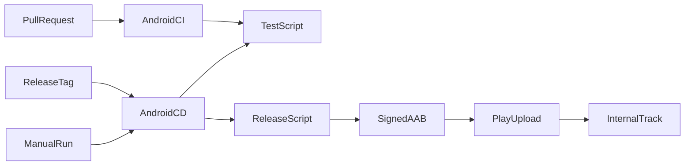

# Design Document

## Overview

最小のJetpack ComposeアプリとGradle Wrapperを追加し、GitHub Actionsでlint、単体テスト、debug buildを行う。配布は別workflowで同じ検証を通した後、Environmentのupload keystoreでAABを署名し、Node.js標準機能だけでGoogle Play Developer APIへuploadしてinternal trackへcommitする。

### Goals

- Androidプロジェクトが存在する現在状態でCIを成功可能にする。
- pull requestと配布secretを分離する。
- 長期運用するversionCode、署名、Play APIの境界を明示する。

### Non-Goals

- 製品機能、API client、DI frameworkの導入。
- production公開、段階公開、ストア掲載情報の更新。
- Play Console、Google Cloud、GitHubの外部画面操作の自動化。

## Boundary Commitments

### This Spec Owns

- `Himatch` Android appと単体テスト。
- Android build/test、署名付きbundle、Play API uploadスクリプト。
- Android CIとGoogle Play internal CD workflow。
- 資格情報名と外部設定runbook。

### Out of Boundary

- アプリの製品機能とClean Architectureの機能層。
- Backend OpenAPIの生成と互換性。
- Google Play production公開とstore metadata。

### Allowed Dependencies

- JDK 21、Gradle 9.6.0、Android Gradle Plugin 9.4.0、compileSdk 37、targetSdk 36。Android向けbytecode targetは17。
- AGP内蔵Kotlin 2.2.10、Compose Compiler plugin 2.2.10、Compose BOM 2026.08.00、AndroidX。
- GitHub-hosted Ubuntu runner、公式checkout/setup-java/upload-artifact actions、Gradle公式setup action。
- Google Play Developer API、Play App Signing、Node.js 24標準API。

### Revalidation Triggers

- AGP、Gradle、Kotlin、Compose BOM、target SDKの変更。
- package name、min/target SDK、署名鍵、Play API資格情報の変更。
- Google Playの対象API要件、Developer API、track契約の変更。

## Architecture



秘密を参照しない`TestScript`をCI/CD共通ゲートにし、秘密を扱う署名と`PlayUpload`は`play-internal` Environmentのjobだけから呼び出す。

### Technology Stack

| Layer | Choice / Version | Role | Notes |
|---|---|---|---|
| Android | AGP内蔵Kotlin 2.2.10 / Jetpack Compose / minSdk 26 | 最小appと単体テスト | 製品機能は未導入 |
| Build | AGP 9.4.0 / Gradle 9.6.0 / JDK 21 | lint、test、APK/AAB build | compileSdk 37、Java/Kotlin target 17、targetSdk 36 |
| CI/CD | GitHub Actions Ubuntu | PR検証とinternal配布 | workflowを分離 |
| Upload | Google Play Developer API v3 | AAB uploadとtrack commit | service account JWT認証 |

## File Structure Plan

```text
apps/android/
├── app/
│   ├── build.gradle.kts
│   └── src/{main,test}/
├── build.gradle.kts
├── settings.gradle.kts
├── gradle.properties
└── gradle/wrapper/
scripts/android/
├── test.sh
├── release.sh
└── upload-play.mjs
.github/workflows/
├── ci-android.yml
└── cd-android-play.yml
```

## Requirements Traceability

| Requirement | Summary | Components | Interfaces | Flows |
|---|---|---|---|---|
| 1.1-1.4 | PR/main検証 | AndroidProject, TestScript, AndroidCI | Gradle exit status | PullRequest → AndroidCI |
| 2.1-2.5 | internal配布 | AndroidCD, ReleaseScript, PlayUpload | Environment values, AAB, Play API | ReleaseTag → InternalTrack |
| 3.1-3.4 | 秘密と運用境界 | ReleaseScript, GitIgnore, Runbook | secret/variable names | Environment → ReleaseScript |
| 4.1-4.3 | 文書整合 | ProjectDocs | documented commands | 実装 → 文書同期 |

## Components and Interfaces

| Component | Intent | Requirements | Dependencies |
|---|---|---|---|
| AndroidProject | build/test/bundleできる最小app | 1.1, 2.1 | Android SDK, Gradle |
| TestScript | CI/CD共通の秘密なし検証 | 1.1-1.3, 2.1 | Gradle Wrapper |
| ReleaseScript | preflight、keystore展開、署名AAB生成、cleanup | 2.2-2.4, 3.2 | JDK keytool, Gradle |
| PlayUpload | OAuth、edit、bundle upload、track更新、commit | 2.3-2.5 | Node.js, Play API |
| AndroidCI | PR/mainの検証起動 | 1.1-1.4 | Ubuntu runner |
| AndroidCD | tag/manual配布とEnvironment境界 | 2.1-2.5, 3.3 | play-internal Environment |
| Runbook | 人が行う外部設定 | 3.4, 4.1-4.3 | Play Console, Google Cloud, GitHub |

### Release batch contract

- **Trigger**: `cd-android-play.yml`のrelease job。
- **Inputs**: upload keystoreとservice account JSONのBase64 secrets、package name、version name/code、鍵alias/password。
- **Validation**: 必須値、厳密なversion/package形式、Base64 decode、keystoreとalias/password、service account JSON必須フィールド、AABの存在。
- **Output**: 署名済みAAB、internal trackへcommitしたrelease。
- **Recovery**: cleanup trapでkeystoreとservice account JSONを削除する。失敗後は原因を直し、同じversionNameと新しいversionCodeで再実行する。

## Security and Validation

- PR jobにはEnvironmentを付けず、secret contextを参照しない。
- release jobのtoken permissionは`contents: read`だけにする。
- secret値をコマンドへ直接埋め込まず、environment variable経由で渡す。
- repository検査、lint、JVM単体テスト、debug build、release preflightを検証する。

## Open Questions / Risks

- 実package name、Play Console app、upload key、service accountはrepository外でユーザーが作成する。
- Play APIは初回AABをAPI経由で受け付けない場合があるため、初回releaseはPlay Consoleから手動uploadが必要になり得る。
- 外部資格情報を使う実uploadはrepository内だけでは検証できない。
