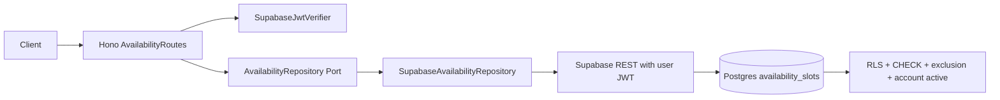
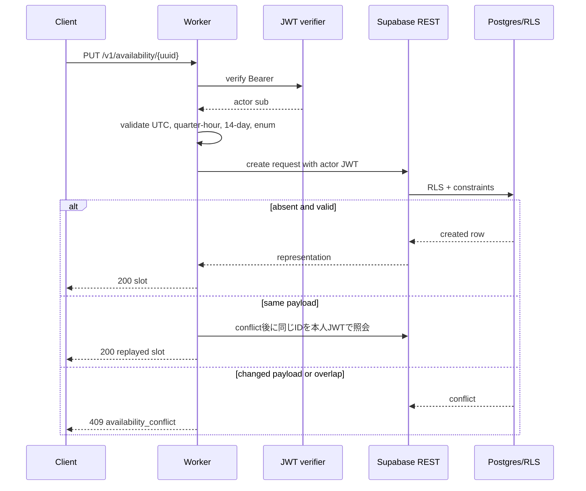

# Backend 暇時間 API 設計

## Overview

Cloudflare Workers の Hono route が Supabase JWT を検証し、利用者の access token を付けた Supabase REST 呼出しへ委譲する。所有者判定は Worker の JWT subject と Postgres RLS の二重境界に置き、Worker の検証漏れだけで他人のデータへ到達できない構成にする。

登録は client UUID を指定する create-only 契約とし、同じ payload の再送だけを replay として成功させる。異なる payload の同一 UUID は conflict、時間重複も conflict とする。募集時共有の判定や友達の暇時間の読み取りはこの境界へ入れない。

### Goals

- 実認証下で本人の slot だけを CRUD できる固定 HTTP 契約。
- API と DB の双方で時間・公開値・所有者・重複を検証する。
- アカウント削除状態と cascade を含むプライバシー境界を維持する。
- 再送、競合、依存障害を安全な error envelope と観測へつなぐ。

### Non-Goals

- 友達への公開判定、募集・回答・予定確定。
- service role を使った通常 Availability 操作。
- 非同期削除 Queue、管理者画面、Push、OpenAPI 配布基盤の実装。

## Boundary Commitments

### This Spec Owns

- `availability_slots` の公開データモデルと制約。
- `/v1/availability` の認証、validation、replay/conflict、DTO、error code。
- Availability の Repository Port/adapter と Worker Composition 接続。
- RLS、アカウント状態、cascade、関連テストの受け入れ証拠。

### Out of Boundary

- Supabase Auth の issuer/JWKS 検証方式そのものは `backend-user-account-management` が所有する。
- 削除受付・Apple token revoke は `backend-user-account-management` が所有し、本仕様はその active 判定を利用する。
- iOS の画面・TCA・Adapter は `ios-availability` が所有する。
- Hosting が承認済み利用者へ候補を投影する契約は将来の Backend Hosting 仕様が所有する。

### Allowed Dependencies

- `SupabaseJwtVerifier` による JWT 検証。
- `supabaseFetch`、publishable key、利用者 access token。
- `public.is_account_active()` と `auth.users` の cascade。
- 既存の `ApiError` envelope と Cloudflare tracing/structured logging。

### Revalidation Triggers

- slot DTO、visibility/category、status code、認証 header の変更。
- owner/RLS、削除状態、重複制約の変更。
- PUT の replay/conflict semantics の変更。
- Supabase key、JWT issuer、Worker Composition の変更。
- iOS Availability または Hosting が共有データを要求する変更。

## Architecture

### Existing Architecture Analysis

現行コードは Availability の Domain model、Repository Port、Supabase REST adapter、Hono route を feature-first に分離し、`createApp` で lazy composition している。route は UUID/JSON/日時を検証し、adapter は Supabase 制約コードを `AvailabilityConflictError` / `AvailabilityUnavailableError` へ変換する。migration は `availability_slots`、owner index、exclusion constraint、window trigger、RLS policy を既に定義している。

設計上の補強点は、検索後 POST の競合窓を create-only semantics として明記し、同一 UUID の所有者境界と同時挿入の winner を DB でも検証すること、また observability の既定フィールドから個人データを排除することである。

### Architecture Pattern & Boundary Map



- Selected pattern: Domain / Application Port / Infrastructure Adapter / Presentation。既存 Backend の境界に合わせ、テストで in-memory repository を差し替え可能にする。
- Actor は JWT subject からのみ決定する。`owner_user_id` は create payload に内部的に付けるが、外部入力として公開しない。
- 通常操作は publishable key と bearer token のみ。secret key は account deletion adapter のみに閉じる。

### Technology Stack

| Layer | Choice / Version | Role in Feature | Notes |
|---|---|---|---|
| HTTP | Hono on Cloudflare Workers | 認証済み route、入力、error envelope | `/v1` 配下 |
| Auth | Supabase JWT / JWKS | actor 検証 | `iss`/`aud`/`role`/`sub`/expiry |
| Data | Supabase Postgres + REST | slot 永続化 | user JWT で RLS 適用 |
| Constraints | CHECK, trigger, `btree_gist` exclusion | DB 最終防衛 | `[)` 区間 |
| Test | Vitest, pgTAP, TypeScript | route/auth/DB 検証 | 実 Supabase 接続は別証拠 |

## File Structure Plan

```text
apps/backend/src/Availability/
├── Domain/Model/Availability.ts
├── Application/Port/AvailabilityRepository.ts
├── Infrastructure/Repository/SupabaseAvailabilityRepository.ts
└── Presentation/AvailabilityRoutes.ts
supabase/
├── migrations/202609250001_availability.sql
└── tests/availability.test.sql
apps/backend/test/availability.worker.test.ts
```

### Modified Files

- `apps/backend/src/Availability/Presentation/AvailabilityRoutes.ts` — schema相当の入力・エラー・観測境界を固定する。
- `apps/backend/src/Availability/Infrastructure/Repository/SupabaseAvailabilityRepository.ts` — actor/ID の再送と同時競合を安全に扱う。
- `apps/backend/src/Shared/Presentation/ApiError.ts` — Availability 以外の envelope 規約を壊さず必要な code を統合する。
- `apps/backend/src/Composition/createApp.ts` — Availability repository を Release composition へ接続する。
- `supabase/migrations/202609250001_availability.sql` — create-only/RLS/window/cascade の DB 契約を明確化・必要なら補正する。
- `supabase/tests/availability.test.sql` — owner、deletion state、overlap、constraint の pgTAP 証拠を補う。
- `apps/backend/test/availability.worker.test.ts` — route の auth、validation、replay/conflict、delete を検証する。

## System Flows



通常の作成は1回のSupabase呼出しとし、競合した場合だけ同一 UUID を actor の RLS 結果で照会して同内容再送を識別する。存在が別 actor の場合はその存在を明示しない。真の同時挿入では DB 制約の conflict を勝者判定に使い、adapter は Supabase の制約コードを安定 error に変換する。

## Requirements Traceability

| Requirement | Summary | Design elements | Evidence |
|---|---|---|---|
| 1 | 認証・本人境界 | JWT verifier, user JWT, RLS | auth/route tests, pgTAP |
| 2 | 本人一覧・非公開 | list DTO, owner policy, sort | route test, RLS test |
| 3 | validation | route parser, DB CHECK/trigger | route test, pgTAP |
| 4 | replay/conflict | UUID create-only, exclusion | route test, adapter/DB test |
| 5 | delete/account state | DELETE, active policy, cascade | route test, pgTAP |
| 6 | errors/observability | error envelope, redacted logs | worker test, log review |
| 7 | contract/evidence | HTTP schema ownership, evidence matrix | typecheck/build/test/OKF |

## Components and Interfaces

| Component | Layer | Intent | Req | Contract |
|---|---|---|---|---|
| `AvailabilityRoutes` | Presentation | JWT、入力、HTTP DTO/error | 1,2,3,4,5,6 | API |
| `AvailabilityRepository` | Application | actor付き persistence port | 2,4,5 | Service |
| `SupabaseAvailabilityRepository` | Infrastructure | user JWT で REST 呼出し | 1,4,5,6 | Service |
| `availability_slots` | Data | owner、区間、公開値の正本 | 2,3,4,5 | State |
| `AvailabilityValidation` | Test/ops | 実装証拠と限界を記録 | 6,7 | Batch |

### AvailabilityRoutes

```typescript
GET    /v1/availability
PUT    /v1/availability/:id
DELETE /v1/availability/:id
```

Response は list が `{ slots: AvailabilitySlot[] }`、create/replay が `{ slot: AvailabilitySlot }`、delete が empty `204`。`AvailabilitySlot` は `id`, `start`, `end`, `category`, `visibility` のみとする。

### SupabaseAvailabilityRepository

`list(actorId, token)`、`upsert(actorId, token, id, input)`、`remove(actorId, token, id)` の Port を維持する。`upsert` という既存名は adapter 内部の互換性のため残せるが、意味は create-only replay/conflict とし、既存行を異なる入力で更新しない。Supabase error body は parse して code だけ使い、ログへ保存しない。

### Data Model

`availability_slots(id uuid PK, owner_user_id uuid FK auth.users ON DELETE CASCADE, start_at timestamptz, end_at timestamptz, category nullable enum-like text, visibility enum-like text, created_at, updated_at)`。`owner_user_id` と `[start_at,end_at)` の GiST exclusion で同一 actor の重複を防ぐ。`is_account_active()` を全 RLS policy に含め、削除受付後は通常アクセスを止める。

### Observability

共通 Worker logging がある場合は route、status、duration、request ID、error category、version のみを許可し、token、header、本文、user ID、区間、内部 Supabase body は redact する。共通基盤が未実装なら本仕様の task は logging interface とテスト可能な redaction を先に置き、ログ基盤導入を未完了証拠として残す。

## Risks & Limitations

- 同一 UUID の同時 create は DB 制約を勝者判定に使う。競合後の再読込で replay/conflict を区別するため、実 DB で並行テストが必要である。
- pgTAP は migration/RLS を検証できるが、Cloudflare 実 runtime、JWT JWKS、staging/production secrets を証明しない。
- 現在の `now()` window は実行時に評価されるため、境界時刻の route と DB の差を時計依存テストで確認する必要がある。
