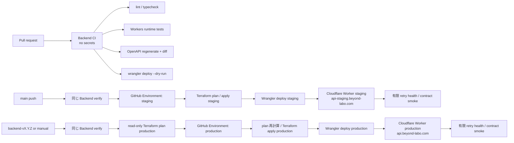

# Backend CI/CD 構成案

## Problem

Backend は private pnpm workspace の TypeScript/Hono Worker として実装され、Cloudflare と Supabase の環境別 Terraform root、migration/RLS 検証、Backend CI/CD が配置されている。
既存方針は Backend、iOS、Android の独立リリース、Backend 所有の OpenAPI、Clean Architecture の依存方向を要求しているため、Cloudflare 固有型や Hono を Domain / Application へ流入させずに実行可能な検証・配布経路を作る必要がある。[^local-technology-policy][^local-api-contract-policy]

## Current State

- GitHub Actions は repository 検査、iOS CI / TestFlight 配布、Android CI / Google Play internal 配布を所有している。
- `apps/backend/package.json` には依存、script、TypeScript 設定がない。
- `apps/backend/openapi/openapi.yaml`、Wrangler 設定、Cloudflare resource、Backend workflow は存在しない。
- Supabase の staging / production Terraform root は provider、partial backend、version constraint、空の `main.tf` に限定され、既存 Project の resource/import はまだ宣言していない。
- Supabase DB schema、RLS、migration は Terraform ではなく `supabase/migrations/` と Supabase CLI が所有する。
- 公開 API は `beyond-labo.com` 配下の Cloudflare Workers Custom Domain で提供する。
- IaC は Terraform を採用し、`infra/cloudflare/` と `infra/supabase/` を provider・state の異なる環境別 root として扱う。

## Desired Outcome

- pull request ごとに、秘密情報なしで Backend の静的検査、型検査、Worker runtime test、OpenAPI 再生成差分、デプロイ bundle を検証できる。
- `main` の検証済み commit を staging へ自動配布し、smoke test で到達性と最低限の契約を確認できる。
- production は専用 GitHub Environment の保護を通過した tag または手動実行だけが変更でき、配布 commit と Cloudflare の version を追跡できる。
- staging と production の Worker、bindings、runtime secrets、観測データを分離する。
- Hono / Cloudflare の依存範囲と、機能ごとの Clean Architecture の境界を両立する。
- Supabase Terraform は secretless な `fmt`、`init -backend=false`、`validate` のみを CI で行い、Project の apply/import は棚卸しと承認後の別工程にする。

## Approach

### 採用案

GitHub Actions を CI/CD の正本とし、lockfile に固定した Wrangler CLI から Cloudflare Workers を配布する。
Cloudflare の Workers Builds も利用可能だが、この repository では既存の required checks、GitHub Environment、モバイルアプリと独立した tag 命名、OpenAPI 差分検査を GitHub Actions 上で一貫して扱う方を優先する。
Cloudflare は非対話 CI からの配布に account ID と API token を要求し、権限を対象 account / zone に絞ることを推奨している。[^cloudflare-github-actions]

長寿命の Cloudflare infrastructure は Terraform で管理し、`infra/cloudflare/` を正本にする。
Terraform は resource lifecycle と state を所有し、Wrangler は Worker の code、version、deployment と Worker 固有設定を所有する。
Cloudflare は一部 resource を Terraform、別の resource を他の tool で管理する構成を許容する一方、同じ resource を複数 tool で管理しないよう求めている。[^cloudflare-terraform-best-practices]

Wrangler の `staging` / `production` 環境を使い、`himatch-backend-staging` と `himatch-backend-production` の別 Worker を作る。
Wrangler environment は環境ごとに別 Worker を生成し、secret は継承されないため、設定と資格情報の誤混入を避けられる。[^cloudflare-environments]

Worker が API の origin であるため、通常の Workers Route ではなく Custom Domain を採用する。
`staging` は `api-staging.beyond-labo.com`、`production` は `api.beyond-labo.com` とし、`apps/backend/wrangler.jsonc` の各 environment に `routes[].custom_domain: true` を定義する。
正式な Custom Domain へ移行した後は `workers_dev: false` とし、意図しない `workers.dev` 二重公開を防ぐ。
Cloudflare が Custom Domain に対応する DNS レコードと TLS 証明書を自動作成するため、Wrangler が Custom Domain、DNS、証明書の一連の設定を所有し、Terraform は同じ DNS、Route、Custom Domain resource を定義しない。[^cloudflare-custom-domains]

Hono は受信 HTTP と route composition に限定する。
Cloudflare bindings は `wrangler types --env-interface CloudflareBindings` で生成し、EntryPoint、Composition、Infrastructure の adapter からだけ参照する。
Hono は `c.env` に typed bindings を渡せるため、`process.env` を前提にしない。[^hono-cloudflare-workers]

HTTP schema は Presentation が所有し、`@hono/zod-openapi` を第一候補として request validation と OpenAPI 生成元を同一にする。
生成した `apps/backend/openapi/openapi.yaml` を commit し、CI で再生成差分を検出する。[^hono-zod-openapi][^local-api-contract-policy]

### 初期段階で採用しない案

- Cloudflare Workers Builds を deploy の正本にしない。GitHub Actions と deploy trigger / status が二重化するため。
- Terraform から Hono bundle / Worker version を upload しない。Worker script を Terraform と Wrangler の双方が管理する状態を避けるため。
- pull request ごとの remote preview deploy を必須にしない。version preview URL は有用だが公開 URL になり、現時点では preview URL の log を利用できないため、秘密を持たない専用 test bindings と access policy が決まってから追加する。[^cloudflare-preview-urls]
- production の gradual deployment を初期要件にしない。複数 version が同時稼働して version skew が発生し得るため、公開 API と永続化の後方互換規則、観測指標、停止条件が揃ってから導入する。[^cloudflare-versions]
- D1、Durable Objects、KV、R2、DynamoDB のいずれかを CI/CD の都合だけで採用しない。

## Proposed Architecture



### Terraform boundary

実装時は次の root module 構成とし、staging と production の state、資格情報、apply 権限を分離する。
Terraform CLI workspace だけで環境を分けず、環境ごとに独立した root module と remote state を持つ。

```text
infra/cloudflare/
├── README.md                         # 所有境界、bootstrap、plan/apply、復旧
├── environments/
│   ├── staging/
│   │   ├── versions.tf              # Terraform / provider constraint
│   │   ├── providers.tf
│   │   ├── backend.tf               # 資格情報を含まない partial config
│   │   ├── main.tf
│   │   ├── variables.tf
│   │   ├── outputs.tf
│   │   └── .terraform.lock.hcl
│   └── production/
│       └── ...                       # staging と別 state / credentials
└── modules/                          # 同じ resource 群を反復すると確定してから追加
```

初期から抽象 module を量産せず、環境間で同じ resource 群が繰り返されることを確認してから `modules/` へ抽出する。
Cloudflare provider と Terraform の version は制約を定義し、`.terraform.lock.hcl` を commit する。[^cloudflare-terraform-provider]

| 所有者 | 管理対象 | 管理しない対象 |
| --- | --- | --- |
| Terraform | D1 / KV / R2 / Queue 等の長寿命 resource、Access / WAF / rate limit 等の account・zone policy、Wrangler の Custom Domain と競合しない DNS | Hono bundle、Worker version、deployment、`api-staging` / `api` の DNS、Route、Custom Domain |
| Wrangler | Worker code、version、deployment、bindings、Custom Domain、対応 DNS / TLS 証明書、trigger、Worker 観測設定 | Terraform state を持つ長寿命 resource の作成・削除 |
| GitHub Actions | 検証順、Environment approval、Terraform / Wrangler の起動 | Cloudflare resource の手動複製 |

Route、Custom Domain、bindings、DNS record など両 tool の操作が競合し得る項目も、一項目につき一方だけを正本にする。
この構成では Wrangler が Custom Domain と Cloudflare の自動 DNS / TLS 設定を所有するため、Terraform へ同じ DNS、Route、Custom Domain resource を追加しない。
Terraform output から Wrangler が必要とする非機密 resource identifier を渡す方法は design で固定し、secret を生成 config や artifact に含めない。

### Runtime boundary

```text
apps/backend/
├── src/
│   ├── EntryPoint/
│   │   └── index.ts                 # Worker module export
│   ├── Composition/
│   │   └── Factory/                 # Hono app と各 adapter の組み立て
│   └── <Feature>/
│       ├── Domain/                  # Hono / Cloudflare import 禁止
│       ├── Application/             # Hono / Cloudflare import 禁止
│       ├── Presentation/            # route、schema、handler、mapper
│       └── Infrastructure/          # binding / 外部 API adapter
├── openapi/openapi.yaml             # HTTP schema からの生成物
├── test/                            # feature boundary / Worker integration test
├── worker-configuration.d.ts        # Wrangler 設定からの生成物
├── wrangler.jsonc                   # Worker、bindings、環境、観測設定の正本
├── vitest.config.ts
└── tsconfig.json
```

Hono の app object と Cloudflare Worker の module export を分ける。
これにより Presentation の request test は Hono app に直接行い、bindings を含む integration test は Workers runtime で行える。
Cloudflare は Workers 向け unit test に Vitest integration、複数 Worker や production build を通す integration test に `createTestHarness()` を推奨している。[^cloudflare-testing]

## Pipeline Proposal

### 1. Backend CI

候補ファイルは `.github/workflows/ci-backend.yml`。
required check の常時生成を優先し、初期段階では `paths` filter を付けず、すべての pull request、`main` push、手動実行で起動する。

検証順は次とする。

1. commit SHA で固定した checkout action、固定 Node.js / pnpm、`pnpm install --frozen-lockfile`。
2. format / lint、`tsc --noEmit`。
3. Domain / Application の unit test、Hono route test、Workers Vitest integration test。
4. `wrangler types` を再生成し、生成物に差分がないことを確認。
5. OpenAPI を再生成し、commit 済み契約に差分がないことを確認。
6. base branch の OpenAPI と比較し、破壊的変更候補を報告。意味上の互換性は review と contract test で補う。
7. `wrangler deploy --dry-run --outdir ...` で production 相当 bundle を作り、entry point、compatibility date、bindings、bundle size を検査。
8. `terraform fmt -check`、`terraform init -backend=false`、`terraform validate` と静的 security scan を実行する。

外部 fork を含む PR CI は `contents: read` のみとし、Cloudflare API token、remote state credential、runtime secret、GitHub Environment を参照しない。
credential が必要な `terraform plan` は trusted branch / protected Environment でのみ実行する。

### 2. Staging CD

`main` push を trigger とし、Backend CI と同じ verify を成功させてから `staging` Environment に進み、その資格情報で staging state に対する Terraform plan / apply を行う。
lockfile に固定した Wrangler で `wrangler deploy --env staging` を実行し、`https://api-staging.beyond-labo.com/healthz` と代表的な read-only contract を smoke test する。
Custom Domain の DNS レコードと TLS 証明書は Cloudflare が自動作成するため、初回 deploy 直後は反映待ちとして扱う。
smoke は 5 秒 timeout、最大 12 回、5 秒間隔の有限 retry とし、最終的に失敗した場合だけ job を失敗させる。
同一 staging Worker への deploy は `concurrency` で直列化し、新しい main commit が来た場合は未開始 run を置き換える。

### 3. Production CD

通常 trigger は annotated tag `backend-vX.Y.Z` とし、緊急時の `workflow_dispatch` も許可する。
tag の commit が `main` に含まれること、同じ commit の verify が成功することを確認し、read-only credential で production Terraform plan の非機密な要約を作る。
要約を確認してから required reviewer を設定した `production` Environment に進む。
承認後は saved plan artifact を再利用せず、production state lock の下で plan を再計算して apply し、続けて `wrangler deploy --env production` を行う。
deploy 後に `https://api.beyond-labo.com/healthz` と read-only smoke test を行い、commit SHA、Terraform run、Worker version、deployment URL、実行者を job summary に残す。
production の `production-plan` Environment には `BACKEND_HEALTH_URL` を登録せず、production apply/deploy 用の `production` Environment だけに登録する。

Worker version は code、assets、bindings、compatibility 設定を含むが、KV / R2 / D1 / Durable Objects 等の状態変更は version に含まれない。[^cloudflare-versions]
そのため rollback は code rollback と data rollback を分け、破壊的 schema migration と同じ release で旧 code を実行不能にしない。
Cloudflare の rollback は以前の Worker version を即時に 100% traffic へ戻せる一方、接続 resource の状態は戻さない。[^cloudflare-rollbacks]

## Configuration and Secret Ownership

| 対象 | 正本 | 方針 |
| --- | --- | --- |
| Worker name、entry point、compatibility date、非機密 bindings、Custom Domain、`workers_dev` | `apps/backend/wrangler.jsonc` | review 可能にし、Dashboard の手編集を通常経路にしない |
| Wrangler / Hono / TypeScript / test tool version | `apps/backend/package.json` と `pnpm-lock.yaml` | CI で固定版を使用する |
| Cloudflare account ID / API token | GitHub Environment `staging` / `production-plan` / `production` | 初回発行時は Workers product-level Admin、通常運用は product-level Editor とし、`beyond-labo.com` だけに Zone > Workers Routes > Edit を追加する。Custom Domain は per-Worker role 非対応であり、DNS Write は不要とする |
| Custom Domain health URL | `staging` / `production` の GitHub Environment `vars` | staging は `https://api-staging.beyond-labo.com`、production は `https://api.beyond-labo.com`。`production-plan` には登録しない |
| application runtime secret | Cloudflare Worker secret、環境別 | 値を repository と `wrangler.jsonc` に保存しない。GitHub から毎 deploy で再注入しない |
| local secret | gitignore 済み `.dev.vars*` | sample は名前だけを記載し、実値を含めない |
| OpenAPI | Backend HTTP schema が正本、YAML は commit 済み生成物 | CI で再生成差分と互換性を確認する |
| Terraform code / provider lock | `infra/cloudflare/` | public repository に commit 可能。秘密値を直接記述しない |
| Terraform state / saved plan | private remote backend | environment ごとに分離し、暗号化、access control、locking、versioning を必須にする |
| Terraform provider / backend credential | GitHub Environment または専用 secret manager | source、`.tfvars`、backend config、artifact に保存しない |

Terraform state と saved plan は resource metadata や secret を含み得る。
`sensitive = true` は表示を隠すだけで state から値を除去する保証ではないため、state を Git に commit せず、secure remote backend で保護する。[^terraform-sensitive-data][^terraform-state]

## Public Repository Risk Assessment

repository を public のまま運用すること自体は許容できる。
`.tf` と `.terraform.lock.hcl` は公開を前提に review 可能な宣言として扱い、次を満たすことを公開継続の条件とする。

- `terraform.tfstate*`、`*.tfplan`、`.terraform/`、secret を含む `*.tfvars`、backend credential、`.env*`、`.dev.vars*` を commit しない。
- state は private remote backend に保存し、staging / production で state と read / write 権限を分離する。
- PR workflow は secret を受け取らず、`pull_request_target` で untrusted code を checkout しない。
- production apply / deploy は GitHub-hosted runner、protected Environment、required reviewer、最小権限 token でのみ実行する。
- third-party action は commit SHA へ固定し、`GITHUB_TOKEN` は job ごとに最小権限を指定する。
- `.github/workflows/**` と `infra/cloudflare/**` に CODEOWNERS と branch protection を設定する。
- Terraform plan 全文や saved plan を public PR comment / public artifact に載せず、機密でない要約だけを表示する。
- account ID、zone ID、resource ID は認証 credential ではないが、構成の列挙を容易にするため、不要なら公開 code に固定せず Environment variable から渡す。
- origin、内部 hostname、IP allowlist、Access policy の対象、WAF bypass 条件など攻撃の手掛かりになる詳細は、公開の利点より露出リスクが高ければ private module / private variables へ分離する。

GitHub は public repository の self-hosted runner を原則使用しないこと、untrusted PR content と privileged workflow を分離すること、token を最小権限にすることを推奨している。[^github-actions-secure-use]
この条件を維持できない場合、少なくとも `infra` と privileged workflow を private repository に分離する。

## Observability and Recovery

- `wrangler.jsonc` で Workers Logs を環境別に有効化し、production は費用と個人情報を考慮して sampling rate を決める。
- structured log に `request_id`、commit SHA または version metadata、route、status、duration、error category を持たせ、token、認証 header、本文、個人情報を既定で記録しない。
- `/healthz` は process の稼働確認に限定し、認証不要でも内部設定や依存先情報を返さない。
- deploy 後 smoke failure では自動でデータ操作をせず、直前の安定 version への rollback を運用手順として用意する。
- migration 導入後は expand / contract と後方互換を必須にし、code rollback 可能期間を明示する。

## Scope

### In

- TypeScript / Hono / Cloudflare Workers の runtime boundary。
- Backend CI の検証ゲート。
- staging 自動配布と production 保護配布。
- Wrangler environment、deploy credentials、runtime secrets の所有境界。
- Terraform による Cloudflare の長寿命 infrastructure と state / apply 境界。
- OpenAPI 生成・差分検査と rollback の基本方針。

### Out

- 認証・認可方式と provider 選定。
- DB、cache、queue、object storage の選定と schema。
- 任意の追加 DNS レコード、WAF、rate limit の具体値。
- Cloudflare account / zone の初期 bootstrap と課金 plan 選定。
- 製品 API の endpoint、DTO、認可規則。
- production gradual deployment の自動化。

## Boundary Candidates

- `backend-runtime`: Hono app、Worker EntryPoint、bindings adapter、health endpoint。
- `backend-ci`: 静的検査、Worker test、OpenAPI / type generation、dry-run bundle。
- `backend-infrastructure`: `infra/cloudflare/`、環境別 state、long-lived Cloudflare resource。
- `backend-deployment`: staging / production workflow、Environment、smoke、rollback runbook。

初期実装は相互依存が強いため、一つの `backend-ci-cd` 仕様で扱い、永続化 resource や認証基盤は採用決定時に独立仕様へ分ける。

## Out of Boundary

- iOS CI/CD と TestFlight 資格情報。
- Android CI/CD と Google Play 資格情報。
- Feature の Domain / Application 要件。
- Cloudflare 外の consumer が購読する event contract。

## Upstream / Downstream

### Upstream

- repository の GitHub Actions / branch protection 方針。
- `docs/architecture/technology.md` の Backend 層と依存規則。
- `docs/architecture/api-contracts.md` の OpenAPI 所有・生成方向・互換性方針。
- Cloudflare Workers / Wrangler / Hono の runtime contract。

### Downstream

- 最初の Backend feature と HTTP schema。
- iOS / Android の生成 client と Adapter test。
- DB / queue / notification Worker の resource provisioning と migration。
- 追加の WAF、rate limit、monitoring / alerting。

## Existing Spec Touchpoints

- **Adjacent:** `.kiro/specs/ios-ci-cd/` と `.kiro/specs/android-ci-cd/`。trigger 命名と Environment 分離の考え方を共有するが、release と秘密情報は独立する。
- **Extends:** 現時点で Backend CI/CD を所有する既存 spec はないため、新規 `backend-ci-cd` 仕様とする。
- **Policy impact if adopted:** `docs/architecture/technology.md` の HTTP framework / Terraform / CI-CD 現在状態、`docs/architecture/package-structure.md` の `infra/cloudflare/`、`docs/operations/backend-ci-cd.md` と `docs/operations/development.md` を更新する。

## Constraints

- Backend、iOS、Android を独立して build / release できること。
- Domain / Application は Hono、Cloudflare SDK、HTTP schema、DB record に依存しないこと。
- OpenAPI は Backend の HTTP schema から決定的に生成し、生成物を commit すること。
- PR CI は deploy credential と runtime secret を持たないこと。
- production deploy は protected Environment を経由し、実行 commit と Worker version を追跡できること。
- Terraform と Wrangler が同じ Cloudflare resource を管理しないこと。
- Terraform state / plan / credential を repository と公開 artifact に保存しないこと。
- storage migration は Worker version rollback で戻らないことを前提に設計すること。
- action、Node.js、pnpm、Wrangler、Hono、test tool、compatibility date は実装時に固定し、定期更新を独立した変更として検証すること。

## Open Decisions Before Requirements

1. Cloudflare の初回 bootstrap credential、GitHub Environment、state backend、課金 plan。
   `beyond-labo.com` zone は Worker を配布する Cloudflare account 内に存在し、Active であることを初回 preflight で確認する。
   異なる account にある場合は、zone の移管または Worker を zone 所有 account に配置する方針を決めるまで実装を進めない。
2. remote state backend。暗号化、locking、versioning、環境別 access control を満たすものから選ぶ。
3. Terraform と Wrangler 間で非機密 resource identifier を渡す契約。
4. production Environment の reviewer と緊急 apply / deploy 権限。
5. 最初の feature が必要とする永続化、整合性、region / data residency。
6. 認証 provider と Cloudflare 上での token 検証方式。
7. OpenAPI 互換性 tool とサポート対象 version の期間。
8. logs / traces の sampling、retention、alert threshold、個人情報分類。

## Recommended Next Step

この brief を入力に `$kiro-spec-quick backend-ci-cd` で requirements、design、tasks を生成する。
実装順は `infra/cloudflare/` の state / provider 基盤、runtime の最小 `/healthz`、CI、Custom Domain の preflight と staging infrastructure / deploy、production infrastructure / deploy、OpenAPI 生成・互換性 gate とする。
Cloudflare account、state backend、bootstrap credential の作成は repository 内の通常 apply と分けて runbook 化する。

[^local-technology-policy]: [技術方針](../../../docs/architecture/technology.md)
[^local-api-contract-policy]: [API 契約](../../../docs/architecture/api-contracts.md)
[^cloudflare-github-actions]: [Cloudflare Workers: GitHub Actions](https://developers.cloudflare.com/workers/ci-cd/external-cicd/github-actions/)（2026-09-19 確認）
[^cloudflare-custom-domains]: [Cloudflare Workers: Custom Domains](https://developers.cloudflare.com/workers/configuration/routing/custom-domains/)（2026-09-20 確認）
[^cloudflare-environments]: [Cloudflare Workers: Environments](https://developers.cloudflare.com/workers/wrangler/environments/)（2026-09-19 確認）
[^cloudflare-testing]: [Cloudflare Workers: Testing](https://developers.cloudflare.com/workers/testing/)（2026-09-19 確認）
[^cloudflare-versions]: [Cloudflare Workers: Versions and deployments](https://developers.cloudflare.com/workers/versions-and-deployments/)（2026-09-19 確認）
[^cloudflare-preview-urls]: [Cloudflare Workers: Preview URLs](https://developers.cloudflare.com/workers/versions-and-deployments/preview-urls/)（2026-09-19 確認）
[^cloudflare-rollbacks]: [Cloudflare Workers: Rollbacks](https://developers.cloudflare.com/workers/versions-and-deployments/rollbacks/)（2026-09-19 確認）
[^hono-cloudflare-workers]: [Hono: Cloudflare Workers](https://hono.dev/docs/getting-started/cloudflare-workers)（2026-09-19 確認）
[^hono-zod-openapi]: [Hono: Zod OpenAPI](https://hono.dev/examples/zod-openapi)（2026-09-19 確認）
[^cloudflare-terraform-best-practices]: [Cloudflare Terraform: Best practices](https://developers.cloudflare.com/terraform/advanced-topics/best-practices/)（2026-09-19 確認）
[^cloudflare-terraform-provider]: [Cloudflare Terraform Provider](https://developers.cloudflare.com/api/terraform/)（2026-09-19 確認）
[^terraform-sensitive-data]: [HashiCorp: Manage sensitive data](https://developer.hashicorp.com/terraform/language/manage-sensitive-data)（2026-09-19 確認）
[^terraform-state]: [HashiCorp: Terraform state](https://developer.hashicorp.com/terraform/language/state)（2026-09-19 確認）
[^github-actions-secure-use]: [GitHub Actions: Secure use reference](https://docs.github.com/en/actions/reference/security/secure-use)（2026-09-19 確認）
