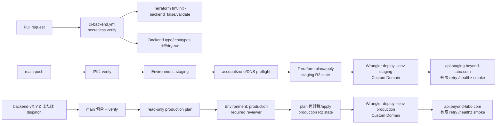
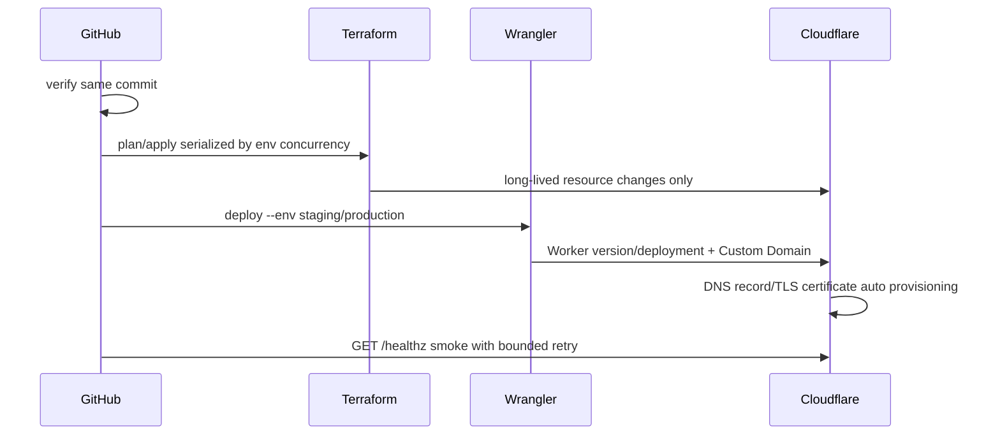

# Design Document

## Overview

本設計は、既存の TypeScript/Hono Cloudflare Worker に、秘密情報なしで実行できる Backend PR CI、Terraform の Cloudflare 長寿命 infrastructure scaffold、`main` から staging への自動配布、タグまたは手動実行から production への承認配布を追加する。
公開 API の hostname は Cloudflare Workers Custom Domain の `api-staging.beyond-labo.com` と `api.beyond-labo.com` に固定し、Terraform と Wrangler の所有境界を明示して環境別 state と credential を分離する。

実 Cloudflare account、R2 bucket、GitHub Environment、secret、required reviewer の bootstrap は外部運用の責務であり、今回のローカル完了条件には含めない。初期 Terraform root は provider/state/環境境界と検証可能な scaffold のみを持ち、未決定の Cloudflare resource は宣言しない。

### Goals

- PR で frozen install、生成型差分、typecheck、Workers Runtime test、Wrangler dry-run、Terraform fmt/backend=false init/validate を secretless に検証する。
- `infra/cloudflare/environments/staging` と `production` を別 root/state とし、R2 S3 backend の partial config を安全に使う。
- staging は verify → Terraform plan/apply → Wrangler deploy → `/healthz` smoke、production は main 包含確認 → read-only plan → protected approval → plan 再計算/apply → Wrangler deploy → smoke の順序を固定する。
- staging は `api-staging.beyond-labo.com`、production は `api.beyond-labo.com` の Custom Domain だけを公開入口とし、両 environment の `workers_dev` を `false` にする。
- 初回 Custom Domain 作成前に account/zone 一致、zone Active、既存 A/AAAA/CNAME 競合を確認し、Cloudflare が自動作成する DNS/TLS の反映を有限 retry で待機する。
- GitHub-hosted runner、最小権限、SHA pin、concurrency、rollback と secret/vars 契約を文書化する。

### Non-Goals

- Cloudflare account/R2 bucket bootstrap、credential 発行、GitHub Environment/branch protection/reviewer の設定。
- Terraform による Worker script、version、deployment、binding、route の管理。
- D1/KV/R2/Queue、追加の DNS レコード、WAF、認証、業務 API、OpenAPI 公開、production gradual deployment。
- 実 Cloudflare 資格情報を使う apply/deploy のローカル検証。

## Boundary Commitments

### This Spec Owns

- `.github/workflows/ci-backend.yml` の secretless verify と Terraform static validation。
- `.github/workflows/cd-backend-staging.yml` と `cd-backend-production.yml` の trigger、順序、Environment、concurrency、smoke、summary。
- `apps/backend/wrangler.jsonc` の Worker 名、environment 別 Custom Domain、`custom_domain: true`、`workers_dev: false`。
- `infra/cloudflare/environments/{staging,production}` の独立 root、provider constraint、partial S3 backend、空の長寿命 resource scaffold、lockfile 契約。
- secret/vars 契約、Custom Domain の account/zone/DNS preflight、state/plan の非公開方針、Worker version rollback の runbook。

### Out of Boundary

- R2 state bucket の作成、Terraform backend credential の保管、Cloudflare account/zone の移管判断。
- 具体的な永続化 resource とその schema、追加 DNS/WAF/Access policy の値。
- GitHub repository settings の実変更。workflow は必要な Environment/branch protection 契約を参照し、bootstrap は運用手順で実施する。

### Allowed Dependencies

- root pnpm workspace と `apps/backend` の既存 script、Wrangler configuration、`/healthz` 契約。
- GitHub-hosted `ubuntu-24.04` runner、GitHub Actions の protected Environment/vars/secrets。
- Terraform CLI と Cloudflare provider、Cloudflare R2 の S3-compatible endpoint。

### Revalidation Triggers

- Worker name、Wrangler environment、entrypoint、binding、Custom Domain、`workers_dev`、health URL の変更。
- Terraform provider、Terraform CLI、R2 backend の互換性、state key、resource ownership の変更。
- action SHA、Node.js/pnpm/Wrangler version、Environment 名、secret/vars 名、trigger、approval rule の変更。
- rollback 対象 version、smoke 契約、production tag 規則の変更。

## Architecture



### Architecture Pattern & Boundary Map

- **CI/CD orchestration**: GitHub Actions が検証順、Environment approval、Terraform/Wrangler の起動を所有する。
- **Terraform**: environment ごとの root/state と将来の長寿命 Cloudflare resource を所有する。初期 root は provider と state 境界だけで、未決定 resource を作らない。
- **Wrangler**: `apps/backend/wrangler.jsonc` の environment 設定に基づき Worker code、version、deployment、binding、Custom Domain、対応する自動 DNS/TLS を唯一所有する。
- **Runtime**: `EntryPoint → Composition → Health/Presentation` の既存境界を維持する。CI/CD は runtime code に credential を渡さない。
- **Recovery**: deploy smoke failure は自動データ操作をせず、安定 Worker version の rollback を運用者が実施する。Terraform state/data rollback とは別扱いにする。

### Terraform Boundary

```text
infra/cloudflare/
├── README.md
└── environments/
    ├── staging/
    │   ├── versions.tf
    │   ├── providers.tf
    │   ├── backend.tf
    │   ├── main.tf
    │   ├── variables.tf
    │   ├── outputs.tf
    │   └── .terraform.lock.hcl
    └── production/
        ├── versions.tf
        ├── providers.tf
        ├── backend.tf
        ├── main.tf
        ├── variables.tf
        ├── outputs.tf
        └── .terraform.lock.hcl
```

各 root は同じ構造でも state key と Environment credential は別にする。`backend.tf` は資格情報を持たない `backend "s3" {}` の partial declaration とし、CI の `terraform init` が `TF_STATE_BUCKET`、環境固有 key、R2 endpoint、`AWS_ACCESS_KEY_ID`/`AWS_SECRET_ACCESS_KEY` を external input として注入する。bucket は bootstrap 外部管理であり、Terraform root は自分自身の backend bucket を作成しない。

Cloudflare は R2 で Terraform S3 backend の native lockfile 互換性を保証していないため、初期構成では `use_lockfile` を有効化しない。環境別 GitHub Actions concurrency を排他制御の正本とし、workflow 実行中に同じ state へ手動 apply しない。将来 `use_lockfile` を有効化する場合は、実 R2 上で並行 `plan/apply` の排他と stale lock 回復を統合検証してから仕様を更新する。

初期 `main.tf` は provider が読み込める空の module と検証用の非機密 output だけに留める。D1/KV/R2/Queue/DNS/Route/Custom Domain/WAF 等を resource として推測しない。将来 resource を追加する場合、その resource の唯一の所有者を Terraform または Wrangler のどちらかに決め、他方の設定から除外する。

`api-staging.beyond-labo.com` と `api.beyond-labo.com` の Custom Domain、Cloudflare が自動作成する DNS レコードと TLS 証明書は Wrangler の所有とする。
Terraform には同じ hostname の `cloudflare_record`、Workers Route、Custom Domain resource を定義しない。

`scripts/terraform/init-r2-backend.sh` は環境名と Terraform root を検証し、環境別 state key と R2 endpoint を `mktemp` の一時 backend config へ書き、終了時に削除する。R2 credential は `AWS_ACCESS_KEY_ID` / `AWS_SECRET_ACCESS_KEY` のプロセス環境だけで渡し、一時 HCL やコマンド引数へ書かない。

`scripts/backend/smoke-health.mjs` は `BACKEND_HEALTH_URL` または引数の base URL へ `/healthz` を追加し、timeout 内の 2xx と正確な `{ "status": "ok" }` だけを成功とする。
DNS または TLS 証明書の反映直後に失敗し得るため、timeout 5 秒、最大 12 回、5 秒間隔で接続失敗、timeout、非 2xx、応答契約違反を有限 retry する。
workflow は Terraform plan/apply の詳細を `$RUNNER_TEMP` に閉じ込め、要約と成否だけを job summary へ記録する。

### Secret and Variable Contract

| Scope | GitHub name | Kind | Purpose |
| --- | --- | --- | --- |
| repository/environment vars | `CLOUDFLARE_ACCOUNT_ID` | `vars` | provider/Wrangler の account identifier |
| `staging` / `production-plan` / `production` vars | `TF_STATE_BUCKET` | `vars` | 事前作成済み R2 bucket 名 |
| `staging` vars | `BACKEND_HEALTH_URL` | `vars` | `https://api-staging.beyond-labo.com` に固定する |
| `production` vars | `BACKEND_HEALTH_URL` | `vars` | `https://api.beyond-labo.com` に固定する |
| `production-plan` vars | `BACKEND_HEALTH_URL` | — | 登録しない。preflight は deploy/smoke を実行しない |
| `staging` / `production-plan` | `CLOUDFLARE_API_TOKEN_READ` | `secrets` | Terraform read/plan 専用 token |
| `staging` / `production` | `CLOUDFLARE_API_TOKEN_WRITE` | `secrets` | 初回 Worker 作成は Workers product-level Admin、通常運用は product-level Editor。`beyond-labo.com` に限定した `Zone > Workers Routes > Edit` を追加し、per-Worker Editor へ縮小しない |
| each deploy Environment | `R2_STATE_ACCESS_KEY_ID` | `secrets` | R2 S3 backend access key |
| each deploy Environment | `R2_STATE_SECRET_ACCESS_KEY` | `secrets` | R2 S3 backend secret key |

Workflow は step の環境変数へ必要な値だけをマッピングし、source、`.tfvars`、backend config file、artifact、job summary に secret の実値を書き込まない。`CLOUDFLARE_API_TOKEN_READ` は plan、`CLOUDFLARE_API_TOKEN_WRITE` は apply/deploy のみに使い、staging と production の Environment を混在させない。

### Pipeline Contracts

#### Backend CI (`.github/workflows/ci-backend.yml`)

- `pull_request`、`push` on `main`、`workflow_dispatch` で起動する。`pull_request_target` は使わず、PR は untrusted checkout として扱う。
- `permissions: contents: read`、GitHub-hosted `ubuntu-24.04`、第三者 action は完全な commit SHA pin、`concurrency: backend-ci-${{ github.workflow }}-${{ github.ref }}` を使う。
- `pnpm install --frozen-lockfile` → generated types diff → `pnpm --dir apps/backend typecheck` → Worker test → Wrangler dry-run → 各 Terraform root の `fmt -check/init -backend=false/validate` の順に失敗を伝播させる。
- Cloudflare API/R2 credential と protected Environment は参照しない。

#### Staging (`.github/workflows/cd-backend-staging.yml`)

- `push` on `main` のみを通常 trigger とする。Backend CI 相当の verify job を同じ SHA で先に実行する。
- 初回のみ運用担当者がaccount/zone/DNSの手動preflightを完了する。その後、`environment: staging`、`concurrency: backend-staging`、cancel-in-progressを用いるworkflowがverify → `terraform plan` → `terraform apply` → `pnpm exec wrangler deploy --env staging` → `GET $BACKEND_HEALTH_URL/healthz`の順を固定する。
- 初回 deploy では Custom Domain の DNS/TLS 自動作成が完了してから health が安定するため、smoke は 5 秒 timeout、12 回、5 秒間隔で有限 retry する。
- plan/apply は `backend-staging` concurrency 下で直列化し、state と plan file は artifact にしない。smoke failure は job を失敗させ、後続の自動変更を止める。

#### Production (`.github/workflows/cd-backend-production.yml`)

- `push` tag `backend-v*` と `workflow_dispatch` を trigger とし、tag SHA が `origin/main` の祖先であることを `git merge-base --is-ancestor` で確認する。
- verify 後、`production-plan` Environment の read-only token で非機密 plan summary を作り、saved plan は保存しない。
- `production-plan` Environment の Cloudflare token は read-only とし、R2 backend credential は state read に限定する。`BACKEND_HEALTH_URL` は登録しない。preflight plan は `-lock=false` で実行する。`production` Environment の required reviewer 承認後、同じ SHA の checkout と `backend-production` concurrency で plan を再計算し、その場で `terraform apply`、Wrangler deploy、health smoke を行う。承認前の plan を apply に再利用しない。
- production の health URL は `https://api.beyond-labo.com` に固定し、smoke は staging と同じ有限 retry を使う。
- `concurrency: backend-production` で production deploy を直列化し、summary に commit SHA、run、Worker version/deployment identifier、URL、actor を出す。

### Rollback Contract

deploy 後 smoke が失敗した場合、workflow は自動で D1/KV/R2/Queue や Terraform state を変更しない。運用者は直前の安定 Worker version を Cloudflare/Wrangler の rollback 手順で 100% traffic に戻し、該当 run と version を記録する。将来 migration を導入する場合は expand/contract と後方互換期間を別仕様で定義し、Worker version rollback が data rollback ではないことを維持する。

## Technology Stack

| Layer | Choice / Version | Role | Notes |
|---|---|---|---|
| Package | pnpm workspace | install/scripts | root lockfile を frozen install |
| Runtime | TypeScript/Hono/Cloudflare Workers | Backend | existing `/healthz` contract |
| CI/CD | GitHub Actions | verify/deploy orchestration | GitHub-hosted, SHA pin |
| IaC | Terraform + Cloudflare provider | long-lived resource/state boundary | env root と lockfile を分離 |
| State | Cloudflare R2 S3-compatible backend | remote state | bucket bootstrap 外部、partial config |
| Deploy | Wrangler | Worker code/version/deployment | Terraform と二重管理しない |

## File Structure Plan

```text
.github/workflows/
├── ci-backend.yml                 # secretless PR/main/manual verify
├── cd-backend-staging.yml         # main -> staging plan/apply/deploy/smoke
└── cd-backend-production.yml      # tag/manual -> plan/approval/apply/deploy/smoke

infra/cloudflare/
├── README.md                      # bootstrap、state、ownership、rollback
└── environments/
    ├── staging/{versions,providers,backend,main,variables,outputs}.tf
    └── production/{versions,providers,backend,main,variables,outputs}.tf
```

### Modified Files

- `apps/backend/README.md` — CI/CD の local verify、Environment 契約、実 deploy の前提を追記する。
- `docs/operations/backend-ci-cd.md` — Backend workflow、secretless PR、staging/production の順序と rollback を記載する。
- `scripts/verify.mjs` — workflow、Terraform root、禁止 artifact/secret path の欠落を検出する。
- `.gitignore` — Terraform state、plan、`.terraform`、secret tfvars を除外する。

## Components and Interfaces

| Component | Intent | Req Coverage | Contracts |
|---|---|---|---|
| BackendCiWorkflow | 秘密情報なしの全検証 | 5, 9 | CI job |
| TerraformEnvironmentRoot | 環境別 provider/state 境界 | 6 | Terraform root |
| StagingDeployWorkflow | main の自動配布 | 7, 9, 10 | deployment job |
| ProductionDeployWorkflow | main 包含・plan・承認・再計算配布 | 8, 9, 10 | deployment job |
| DeploymentRunbook | rollback と外部 bootstrap 契約 | 10 | Operations |
| WorkerRuntime | `/healthz` 実行契約 | 1-4 | HTTP API |

### TerraformEnvironmentRoot

- **Responsibilities**: provider constraint、partial S3 backend、environment-specific state key、将来の長寿命 resource の所有境界。
- **Constraints**: backend bucket を作成しない、credential を commit しない、Worker script/version/deploy/binding/Route/Custom Domain/DNS を宣言しない。
- **Verification**: `fmt -check`、`init -backend=false`、`validate`、禁止ファイル検査。

### Deployment Workflows

- **Inbound**: PR/main/tag/manual event、GitHub Environment vars/secrets。
- **Outbound**: Terraform CLI、Wrangler CLI、HTTPS health smoke。
- **Invariants**: verify failure stops mutation; production approval precedes apply; approved plan is never reused; staging/production credentials are isolated.

### Custom Domain Preflight

- `beyond-labo.com` zone が Worker を配布する Cloudflare account 内に存在し、Dashboard で `Active` であることを確認する。
- DNS Records で `api-staging` と `api` の A、AAAA、CNAME を確認する。
- 既存レコードがある場合は、所有者と用途を確認して競合解消を完了するまで deploy を開始しない。
- Wrangler deploy が Custom Domain を作成し、Cloudflare が DNS レコードと Advanced Certificate を自動作成する。
- 証明書ステータスが `Initializing`、`Pending Validation`、`Pending Issuance`、`Pending Deployment` を経て `Active` になる間は health が一時的に失敗し得るため、smoke の bounded retry で待機する。
- zone が別 account にある場合は、zone transfer または Worker を zone 所有 account に配置する方針を決定するまで実装を進めない。

### Worker Runtime

既存の `EntryPoint`、`Composition`、`Health/Presentation` の責務と `/healthz` の `200 application/json` 固定 payload を維持する。workflow は runtime の内部層へ CI/CD credential を渡さない。

## System Flows



Production の `plan` と `apply` は別 job である。approval 前の plan output は要約のみで、approval 後に環境別 concurrency 下で plan を再計算する。失敗時は以降の mutation を停止する。

## Requirements Traceability

| Requirement | Design elements | Verification |
|---|---|---|
| 1-4 | Worker Runtime、既存 package/scripts | runtime test、typecheck、dry-run、README |
| 5 | BackendCiWorkflow | secretless CI、生成型差分、Terraform static checks |
| 6 | TerraformEnvironmentRoot、R2 partial backend、Wrangler Custom Domain ownership | root/state 分離、DNS/Route/Custom Domain の重複なし、fmt/init/validate、禁止 artifact 検査 |
| 7 | StagingDeployWorkflow、Custom Domain Preflight | main trigger、account/zone/DNS preflight、verify→plan/apply→deploy→有限 retry smoke、concurrency |
| 8 | ProductionDeployWorkflow、Custom Domain Preflight | tag/manual、main ancestor、read-only plan、approval、再計算/apply、Custom Domain deploy、有限 retry smoke |
| 9 | workflow permissions/action pin/secret contract | YAML static check、untrusted PR check、Workers/zone token scope、ownership review |
| 10 | DeploymentRunbook、Rollback Contract | docs review、外部未設定時の local verify、DNS/TLS反映待機、rollback 手順 |
