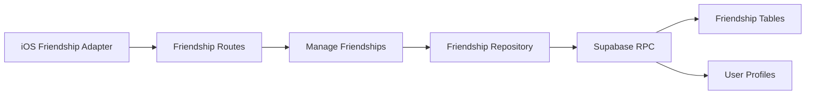
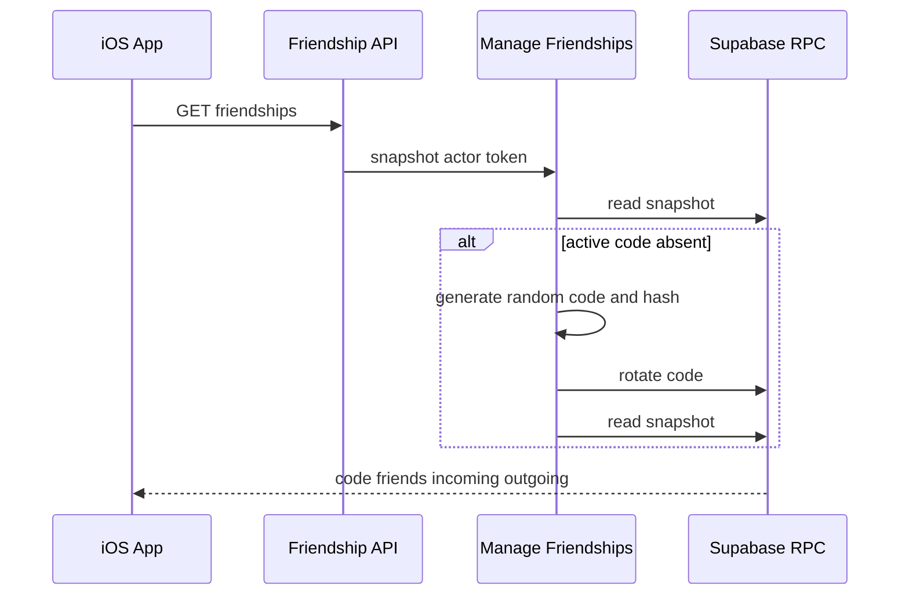

# Design Document

## Overview

Backend Friendship を友達コード、申請、成立済み関係の正本とする。HTTP 層は JWT の actor と入力を UseCase へ渡し、Supabase Repository は利用者 JWT 付き RPC を呼ぶ。RPC は `auth.uid()` を actor として複数行の遷移を原子的に実行する。iOS は FriendshipClient を介して snapshot を AppFeature へ投影する。

## Goals / Non-Goals

- Goal: 初回 snapshot でコードを確実に発行し、コードから承認済み友達までの実 Backend フローを STG で完成する。
- Goal: 再送、競合、相手存在の秘匿を API・DB の両境界で維持する。
- Non-Goal: Safety、Hosting、Availability の本番実装を Friendship へ取り込まない。

## Boundary Commitments

### This Spec Owns

- Friendship の Backend Domain / Application / Presentation / Infrastructure。
- 招待コード、申請、成立済み友達の DB schema と transactional RPC。
- Friendship 公開 API と iOS Backend Adapter の接続契約。最初の Release build は既存 TestFlight 設定により STG を向く。

### Out of Boundary

- ブロック・通報・募集・暇時間・通知。
- 既存プロフィール編集とアカウント削除 orchestration。

### Allowed Dependencies

- Auth の `AccessTokenVerifier` と bearer token 抽出。
- User profile の保存済み最小表示情報。
- Shared の Supabase REST client と API error envelope。

### Revalidation Triggers

- プロフィール公開項目、削除状態 gate、JWT actor、Safety block、Hosting の friend ID 契約の変更。

## Architecture



依存方向は Presentation → Application → Domain、Infrastructure → Application / Domain、Composition → 全境界とする。DB は API の内部実装であり iOS へ行型を公開しない。

## File Structure Plan

```text
apps/backend/src/Friendship/
├── Domain/Model/Friendship.ts
├── Application/Port/FriendshipRepository.ts
├── Application/UseCase/ManageFriendships.ts
├── Infrastructure/Repository/SupabaseFriendshipRepository.ts
└── Presentation/FriendshipRoutes.ts
apps/backend/test/friendship.worker.test.ts
supabase/migrations/*_friendship.sql
supabase/tests/friendship.test.sql
apps/ios/Himatch/Friendship/
├── Application/Port/FriendshipClient.swift
└── Infrastructure/Adapter/BackendFriendshipAdapter.swift
apps/ios/HimatchTests/Infrastructure/BackendAdapterTests.swift
```

`AppCompositionRoot`、`AppDependencies`、`AppFeature`、`AppView` は実 Backend の注入と画面操作を追加する。接続先は `API_BASE_URL` / `SUPABASE_URL` で選び、最初の内部 TestFlight は STG を使う。Prototype scenario は同じ表示 snapshot を供給し続ける。

## System Flows



承認 RPC は pending/version/actor を検証し、申請更新と unordered pair の友達作成を一つのトランザクションで行う。

## Components and Interfaces

| Component | Domain/Layer | Intent | Req Coverage | Key Dependencies | Contracts |
|---|---|---|---|---|---|
| ManageFriendships | Application | 発行、解決、遷移、再送を調整 | 1.1-4.5 | Repository P0 | Service |
| SupabaseFriendshipRepository | Infrastructure | RPC DTO と Domain を変換 | 1.1-4.5 | Supabase REST P0 | Service |
| FriendshipRoutes | Presentation | JWT、HTTP schema、error envelope | 1.4, 2.1-4.5 | Auth P0 | API |
| Friendship RPC | Data | actor 認可と原子的遷移 | 1.2, 2.2-4.5 | auth.uid P0 | State |
| BackendFriendshipAdapter | iOS Infrastructure | API と iOS model を変換 | 5.1-5.6 | URLSession P0 | Service |

### ManageFriendships

**Contracts**: Service [x] / API [ ] / Event [ ] / Batch [ ] / State [ ]

```typescript
interface FriendshipService {
  snapshot(actorId: string, accessToken: string): Promise<FriendshipSnapshot>;
  rotateCode(actorId: string, accessToken: string): Promise<FriendshipSnapshot>;
  resolveCode(actorId: string, accessToken: string, code: string): Promise<FriendProfile>;
  sendRequest(actorId: string, accessToken: string, input: SendRequestInput): Promise<FriendshipSnapshot>;
  transitionRequest(actorId: string, accessToken: string, input: TransitionInput): Promise<FriendshipSnapshot>;
  removeFriend(actorId: string, accessToken: string, input: RemoveFriendInput): Promise<FriendshipSnapshot>;
}
```

- code は `HIMA-` と Crockford Base32 相当のランダム 16 文字で表現し、正規化後の SHA-256 を解決キーにする。
- code の有効期限は発行から7日。snapshot は有効コードがなければ発行してから返す。
- operation ID は各 mutation の idempotency key とし、operation kind と対象・expected version に拘束する。同一 actor / operation ID は advisory lock で直列化し、別対象への再利用を競合にする。version は optimistic concurrency token とする。

### HTTP API

| Method | Endpoint | Request | Success | Business errors |
|---|---|---|---|---|
| GET | `/v1/friendships` | Bearer | snapshot | 401, 403, 503 |
| POST | `/v1/friendship-invite-code/rotate` | Bearer | snapshot | 401, 403, 503 |
| POST | `/v1/friendship-invite-code/resolve` | `{ code }` | candidate | 404 common unavailable |
| POST | `/v1/friendship-requests` | `{ code, operationId }` | snapshot | 404, 409 |
| POST | `/v1/friendship-requests/{id}/{accept|reject|cancel}` | `{ operationId, expectedVersion }` | snapshot | 404, 409 |
| DELETE | `/v1/friendships/{friendId}` | `{ operationId, expectedVersion }` | snapshot | 404, 409 |

snapshot は `inviteCode`、`friends`、`incomingRequests`、`outgoingRequests` を持つ。profile は `userId`、`nickname`、`presetIconKey` のみ。公開 error envelope は既存 `{ error: { code, message, fields? } }` を維持する。

### Friendship RPC and State

**Contracts**: Service [ ] / API [ ] / Event [ ] / Batch [ ] / State [x]

- `friend_invite_codes`: owner、code、code_hash、expires_at、revoked_at。owner ごとに有効コードは最大一件。
- `friendship_requests`: requester、addressee、status、version、last_operation_id。二者間の pending は最大一件。
- `friendships`: unordered user pair、active、単調増加する version、last_operation_id。一組につき tombstone を含め最大一件とし、解除は inactive 化、再成立は version を増やして再活性化する。
- `friendship_operations`: actor、operation ID、kind、対象 fingerprint を保持し、同じ key の同時実行と別 payload への再利用を拒否する。
- authenticated role へ table の直接権限を与えず、許可した RPC だけを公開する。
- security-definer 関数は `search_path = ''`、`auth.uid()`、active account、profile existence を検証する。

## Requirements Traceability

| Requirement | Summary | Components | Interfaces | Flows |
|---|---|---|---|---|
| 1.1-1.5 | コード発行と秘匿 | UseCase, RPC | snapshot, rotate | initial snapshot |
| 2.1-2.5 | 解決と申請 | Routes, UseCase, RPC | resolve, send | code to pending |
| 3.1-3.5 | 申請遷移 | UseCase, RPC | accept, reject, cancel | pending transition |
| 4.1-4.5 | 一覧と解除 | Repository, RPC | snapshot, remove | relation lifecycle |
| 5.1-5.6 | STG iOS 接続 | iOS Adapter, AppFeature | FriendshipClient | staging load and mutations |

## Error Handling

- `invite_code_unavailable`: 404。コードの具体的理由を返さない。
- `friendship_conflict`: 409。iOS は snapshot を再取得する。
- `friendship_unavailable`: 404。当事者でない対象や存在しない対象を区別しない。
- `invalid_friendship_request`: 400。UUID、version、code 形式の構文不正。
- 認証・削除中・一時障害は既存 envelope を再利用する。

## Testing Strategy

- Domain / Application: 初回自動発行、再発行、コード共通エラー、operation ID 再送、version conflict。
- Backend route: JWT actor、公開 DTO、送信・承認・拒否・取消・解除、エラー status。
- SQL: 直接 table 権限の不在、自己操作拒否、他者操作で状態・versionを推測できないこと、operation target binding、承認の原子性、unique pair、解除・再成立時の単調 version。
- iOS Adapter / Reducer: token header、DTO mapping、初回コード表示、確認後送信、競合 reload。
- Build / integration: Backend typecheck/test/build、iOS test/build、友達フロー smoke。

## Security Considerations

- code plaintext は所有者への応答と入力時だけ扱い、ログ・error・他者 snapshot へ出さない。
- code hash lookup、actor authorization、profile join は DB 関数内で行う。
- API は request body の user ID を受け取らない。
- Safety block が本番化された時点で resolve/send RPC の再検証を必須とする。
