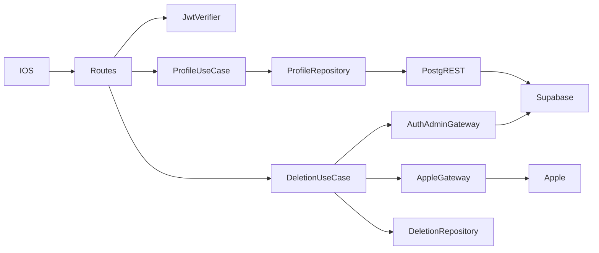
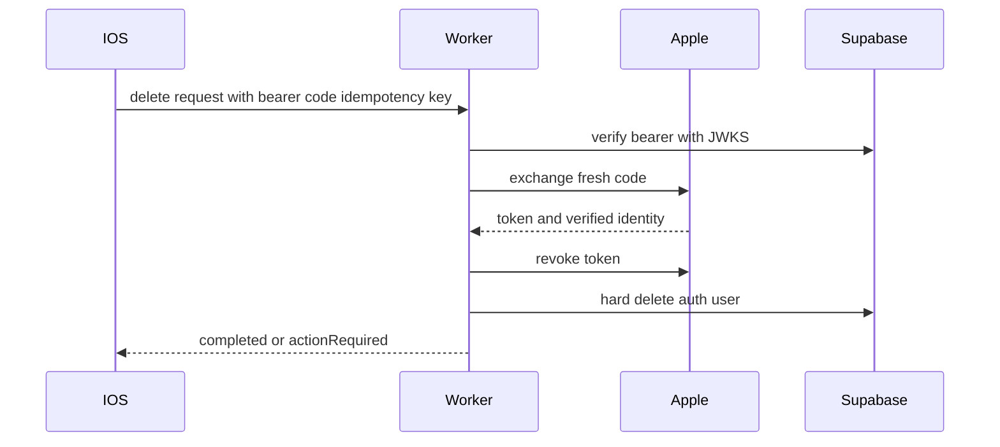

# Design Document

## Overview

Cloudflare WorkerをSupabase AuthのResource Serverとして拡張する。
通常のプロフィール操作はpublishable keyと利用者JWTをPostgRESTへ渡し、RLSを二重の認可境界とする。
Apple token失効とSupabase Auth user削除だけを特権Adapterへ隔離する。

### Goals

- Appleのみの認証セッションを検証し、本人のプロフィールを管理する。
- アプリ内削除をApple失効とSupabase hard deleteまで完了させる。
- secretを通常処理へ漏らさず、外部I/Oを差し替えて検証できるようにする。

### Non-Goals

- メール・パスワード認証、Android、友達・暇・募集データの永続化。
- Queueを使う長時間ジョブ。初版の外部処理は要求内で同期実行する。

## Boundary Commitments

### This Spec Owns

- Supabase JWT検証、`/v1/me`、`/v1/account-deletion-requests`、プロフィールと削除受付のDB schema。
- Apple code交換・token失効、Supabase Auth admin deleteのAdapter境界。
- migrationのsecretless検証、環境別適用順序、WorkerとiOSへの設定注入境界。

### Out of Boundary

- iOSのnative Apple UI、Supabase session保存、他の業務APIと業務データ消去。

### Allowed Dependencies

- Hono、Cloudflare Workers、`jose`、Supabase Auth/PostgREST、Apple OAuth endpoint。

### Revalidation Triggers

- Supabase JWT key方式・issuer、Apple token/revoke契約、プロフィール項目、削除対象データの追加。

## Architecture



依存方向はPresentation → Application → Domain、Infrastructure → Application / Domain、Composition → 全層とする。

### Technology Stack

| Layer | Choice / Version | Role | Notes |
|---|---|---|---|
| Runtime | Cloudflare Workers / Hono 4.13.7 | HTTP | 既存構成を維持 |
| JWT | jose 6.x | JWKS署名検証・Apple client secret | 固定版をlockfileへ記録 |
| Auth/Data | Supabase Auth / Postgres / PostgREST | session、profile、RLS | 通常経路はpublishable key＋user JWT |
| Identity | Apple OAuth endpoints | code交換・token失効 | secretはWorker secret |

## File Structure Plan

```text
apps/backend/src/
├── Auth/                # JWT principalの確定
├── UserProfile/         # /v1/meとPostgREST adapter
├── AccountDeletion/     # 削除状態、Apple/Admin adapter
├── Composition/createApp.ts
└── EntryPoint/index.ts
supabase/migrations/     # profile、deletion request、RLS
supabase/config.toml     # secretless local database
.github/workflows/ci-supabase.yml
```

## Deployment Flow

- Pull RequestはSupabase CLI 2.117.0を固定し、Docker上の空DBへmigrationを適用してlintとpgTAPを実行する。
- stagingはmain pushから、productionはrelease preflightとEnvironment承認後に、Terraform apply、`db push --dry-run`、`db push --yes`、linked migration履歴確認、Worker deployの順で進める。
- migrationはforward-onlyとし、旧Workerと新Workerの両方で動くexpand / contractを採用する。
- Repository CIはDROP、TRUNCATE、DELETE、rename、SET NOT NULLを破壊的変更候補として停止し、承認済みcontract migrationだけ明示的なreview markerで許可する。
- GitHub `production-plan`はSupabase変更資格情報を持たず、production EnvironmentだけがDB passwordとruntime secretへ到達する。
- stagingとproductionは別Organization、別Project、別Supabase CI identity／access tokenとし、各identityのmembershipを対応Organizationだけへ制限する。runbookは初期構築の完成形とcheckpointを先に示し、既存状態にかかわらず未完了工程から再開できる構成にする。既存Organizationの改名とProject transferは、2 Projectが同じOrganizationにある場合だけ使う補正経路とする。
- 各Organizationへ対応するCI accountだけをDeveloperとして招待し、そのaccountから発行したclassic personal access tokenをGitHubの`staging`または`production` Environmentだけへ登録する。scoped tokenを利用できる場合もOrganization分離を主境界として維持する。
- remote環境は東京regionの`himatch-staging`／`himatch-production`という別Projectにし、Data API ON、自動table公開OFF、自動RLS ONとする。初版ではSupabase Branchingを環境分離に使わない。
- staging用OrganizationはFreeを維持し、production用Organizationは実ユーザーを受け入れるApp Store公開前にProへ変更する。Proは停止回避、日次backup、7日間のlog保持、Email supportに使い、Project-scoped accessの根拠にはしない。
- Workerの公開値はWrangler `--var`、secretはephemeral runnerの`--secrets-file`で同じversionへ渡す。
- DB migration開始後の失敗はlinked履歴を再取得してjob summaryへ部分releaseとして表示し、corrective migrationまたは同一commit再実行へ誘導する。
- TestFlightはrelease refが厳密なannotated tagか現在のmainであることを検証し、archiveへはSupabase URL、publishable key、Backend API URLだけを渡す。

## System Flows



## Contracts

- `GET /v1/me` → `200 { userId, profile: null | { nickname, presetIconKey } }`。
- `PUT /v1/me` ← `{ nickname, presetIconKey }` → 同じprofile。`nickname`はtrim後1〜20 grapheme、iconは4種類。
- `POST /v1/account-deletion-requests` ← `Idempotency-Key`、`{ appleAuthorizationCode }` → `{ reference, status, statusToken }`。同時競合で既存受付を返す場合は`accepted`または`processing`を保持する。
- `GET /v1/account-deletion-requests/{reference}` ← `Authorization: Deletion <statusToken>` → `{ reference, status, message? }`。statusは`accepted | processing | completed | actionRequired`。

JWTはissuer=`<SUPABASE_URL>/auth/v1`、audience=`authenticated`、role=`authenticated`、UUID subjectを必須にする。
削除要求はApple交換後のID tokenをApple JWKSで検証し、Supabase userのApple identity subjectと一致させる。

## Data Models

- `user_profiles`: `user_id` PK/FK、`nickname`、`preset_icon_key`、timestamps。`auth.users`削除でcascade。
- `account_deletion_requests`: auth user削除後も状況を残すためFKを持たず、`(user_id, idempotency_key)` unique、`reference`、`status`、状況tokenのhash、message、timestampsを保持する。
- RLSは本人のSELECT/INSERT/UPDATEだけを許可し、削除受付済みなら拒否する。

## Requirements Traceability

| Requirement | Components | Validation |
|---|---|---|
| 1.1-1.4 | JwtVerifier, auth middleware | JWT unit / route tests |
| 2.1-2.5 | ProfileUseCase, ProfileRepository, RLS | validation / repository tests |
| 3.1-3.7 | DeletionUseCase, AppleGateway, AuthAdminGateway | identity / idempotency / failure tests |
| 4.1-4.4 | migrations, injected Ports | unit / typecheck / build |
| 4.5-4.13 | Supabase CI, environment-gated CD, iOS release settings, Organization／Plan runbook | fresh DB / pgTAP / workflow contract / runbook review |

## Security Considerations

- 特権secretは削除Compositionだけへ注入し、ログ・応答・通常Repositoryへ渡さない。
- JWTのsubjectをrequest入力で上書きしない。
- 状況tokenは高エントロピーsecretを鍵にしたreferenceの決定的HMACとし、冪等再送でも同じtokenを再構成する。DBにはSHA-256 hashだけを保存し、生tokenは保存・ログ出力しない。
- Auth user削除後も既発行JWTは期限まで暗号学的に有効なため、RLSで削除受付済みを拒否する。
- Pull Request CIは外部Project、GitHub Environment、実資格情報へ接続しない。
- DB変更資格情報とserver secretはprotected Environmentに置き、production承認前のjobへ渡さない。
- Supabaseの環境境界はOrganizationとProjectで分離し、各Projectのroot branchに表示される`PRODUCTION`ラベルをアプリ環境名として扱わない。
- Pro Planは運用可用性の境界であり、classic personal access tokenの権限境界ではない。CIは専用accountのOrganization membershipで分離する。

## Testing Strategy

- JWT claim・署名・role・subjectの失敗。
- profileの未設定、保存、grapheme、icon、他人アクセス拒否。
- 削除の本人照合、冪等再送、Apple revoke / admin delete失敗、状況token。
- `pnpm typecheck`、Workers Runtime test、dry-run build。
- 空DBへのmigration初期適用、DB lint、pgTAP、workflow構造検査。
