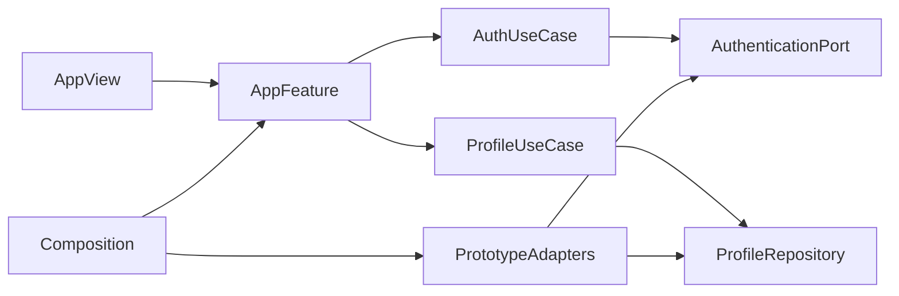

# Design Document

## Overview

SwiftUI の単一暫定画面を TCA の `AppFeature` と `AppView` に置換し、Onboarding、ProfileSetup、MainTab を子機能として合成する。Application は認証・プロフィールの UseCase と Port を所有し、Composition が実装を注入する。

### Goals

- 登録前説明から3タブまでを状態として一貫して表す。
- Apple 認証 UI、Application Port、プロトタイプ Adapter を分離する。
- 後続機能が Root Store に業務データを重複させず合成できる入口を作る。

### Non-Goals

- Backend による credential 検証と実セッション。
- 暇、友達、募集、安全機能の業務実装。
- APNs capability と通知許可。

## Boundary Commitments

### This Spec Owns

- アプリ起動状態、Onboarding、ProfileSetup、3タブとルート Composition。
- `AuthenticationPort`、`ProfileRepository`、入力・失敗型。
- TCA 1.26.1 と filesystem-synchronized Xcode group の導入。

### Out of Boundary

- 各タブの業務状態、サーバー認可、Apple token revoke。

### Allowed Dependencies

- SwiftUI / AuthenticationServices / TCA 1.26.1。
- iOS 17、Swift 6.3、Xcode 26.6。

### Revalidation Triggers

- 認証 API、TCA、Xcode、対応 OS、タブ構成、Backend session 契約の変更。

## Architecture



静的依存は Presentation → Application → Domain、Infrastructure → Application / Domain、Composition → 全層とする。SignInWithAppleButton の結果は Presentation で Apple 型から Application 入力へ変換する。

### Technology Stack

| Layer | Choice / Version | Role | Notes |
|---|---|---|---|
| UI | SwiftUI / iOS 17 | View と Navigation | Dynamic Type / VoiceOver |
| State | TCA 1.26.1 | Reducer、Store、Effect | 1.26.2 は Swift 6.4 要求のため不採用 |
| Auth UI | AuthenticationServices | Apple 標準ボタン | サーバー検証は Port の先 |
| Build/Test | Xcode 26.6 / Swift 6.3 / Swift Testing | app と test | TCA Package.resolved を固定し、XCTest は使用しない |

## File Structure Plan

```text
apps/ios/Himatch/
├── App/Presentation/Reducer/AppFeature.swift
├── App/Presentation/View/AppView.swift
├── App/Composition/AppCompositionRoot.swift
├── Authentication/Application/{Port,UseCase}/
├── Authentication/Infrastructure/Adapter/PrototypeAuthenticationAdapter.swift
├── Authentication/Presentation/{Reducer,View}/
├── Profile/Application/{Port,UseCase}/
├── Profile/Domain/Model/UserProfile.swift
├── Profile/Infrastructure/Adapter/PrototypeProfileAdapter.swift
├── Profile/Presentation/{Reducer,View}/
├── MainTab/Presentation/{Reducer,View}/
└── Himatch.entitlements
apps/ios/HimatchTests/AppFoundation/
```

既存 `ContentView.swift` は `AppView` の互換入口へ置換し、`HimatchApp.swift` は Composition が作る Store のみ保持する。Xcode project は app/test フォルダ同期と TCA package product を登録する。

## State and Contracts

`AppFeature.State` は `onboarding`、`profileSetup`、`mainTab` の排他的 route と共通 suspension 状態だけを持つ。各子機能は delegate action で完了を親へ通知する。

```swift
struct AppleAuthorizationInput: Equatable, Sendable {
    let authorizationCode: Data
    let userIdentifier: String
}

protocol AuthenticationPort: Sendable {
    func authenticate(_ input: AppleAuthorizationInput) async throws -> SessionSummary
    func signOut() async throws
}
```

失敗は `cancelled`、`unavailable`、`rejected(message)`、`transport` へ正規化する。キャンセルを通信失敗として表示しない。Prototype Adapter は `DEBUG` でのみデモセッションを返し、本番認証成功を装わない。

## Requirements Traceability

| Requirement | Components | Validation |
|---|---|---|
| 1.1-1.5 | OnboardingFeature, AuthenticationPort | Reducer / View tests |
| 2.1-2.4 | ProfileSetupFeature, ProfileRepository | validation / UseCase tests |
| 3.1-3.3 | AppFeature, MainTabFeature | route transition tests |
| 4.1-4.5 | CommonUiState, reusable views | state and accessibility inspection |

## Testing Strategy

- すべての iOS テストは Swift Testing で記述し、XCTest を import しない。
- Domain/Application: 表示名、Port 成功・失敗、キャンセルの翻訳。
- Presentation: TestStore で onboarding → profile → tabs、失敗・再試行、logout。
- Integration: Simulator で起動し DEBUG デモ導線から3タブへ到達。
- Project: TCA resolve、全 Swift ファイルの target membership、既存 CI/CD test。

## Security Considerations

- authorization code、user identifier、暇時間をログへ出さない。
- Keychain を含む永続セッションは Backend 契約確定まで実装しない。
- Sign in with Apple entitlement 追加時は配布 profile の再作成を必要条件として文書化する。
