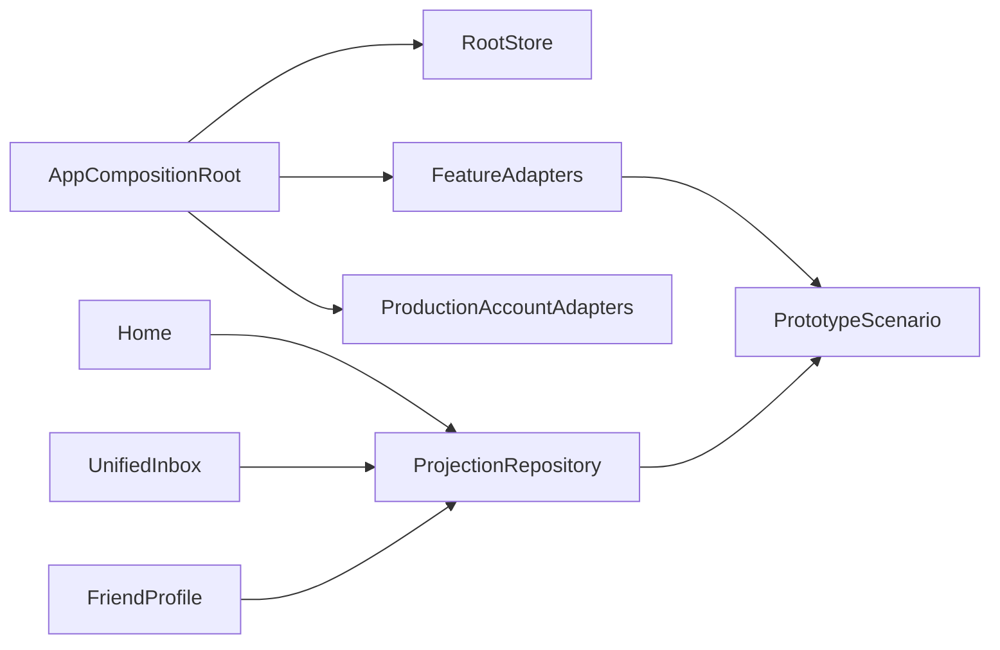

# Design Document

## Overview

`AppCompositionRoot` が全機能のPort実装とTCA Storeを組み立てる。認証・プロフィール・削除はProduction Adapterを標準とし、`HimatchPrototypeScenario` actorはDEBUGの明示的なデモと未接続の業務機能だけに限定する。

## Boundary Commitments

### This Spec Owns

- Root Composition、横断 read model、共有 Prototype scenario、fixture reset、全機能統合テスト。

### Out of Boundary

- 個別機能の業務規則、友達・暇・募集の本番トランザクションとAPI、Push。

### Allowed Dependencies

- 新規5仕様の Domain / Application / Presentation 契約。Composition だけが Infrastructure 実装を参照できる。

### Revalidation Triggers

- 機能 Port、projection DTO、Root Navigation、fixture schema、TCA/Xcode の変更。

## Architecture



## File Structure Plan

```text
apps/ios/Himatch/App/Composition/AppCompositionRoot.swift
apps/ios/Himatch/App/Composition/AppProjectionRepository.swift
apps/ios/Himatch/App/Infrastructure/Prototype/HimatchPrototypeScenario.swift
apps/ios/Himatch/App/Presentation/Reducer/AppFeature.swift
apps/ios/Himatch/App/Presentation/View/AppView.swift
apps/ios/HimatchTests/AppIntegration/
```

## Contracts

`AppProjectionRepository` は `home()`、`inbox()`、`friendPlans(friendID)` の read-only async 操作だけを持つ。DTO は ownerFeature と entityID を持ち、変更操作は Root delegate が所有機能へ route する。

`HimatchPrototypeScenario` は actor 内で全 fixture を保持し、feature adapter factory と reset(seed) を提供する。block/delete は actor メソッド一回で関連状態と revision を更新する。各 Adapter は自機能 Port だけを実装する facade である。

## Requirements Traceability

| Requirement | Components | Validation |
|---|---|---|
| 1.1-1.4 | AppProjectionRepository, Root route | projection / navigation tests |
| 2.1-2.5 | HimatchPrototypeScenario, facets | actor / reset / cross-effect tests |
| 3.1-3.5 | AppCompositionRoot, integration tests | build / Swift Testing / Simulator smoke |
| 3.6-3.7 | ProductionAccountAdapters, AppFeature | composition / restore / logout / deletion tests |

## Testing Strategy

- iOS テストは Swift Testing に統一し、repository verify で XCTest の再混入を拒否する。
- actor: reset、block/delete 原子的更新、revision。
- projection: owner ID、privacy-safe DTO、順序と区分。
- Root: delegate action が所有機能へ遷移する。
- Simulator: デモの主要経路。Backend安全性は MANUAL/BACKEND_REQUIRED として別判定する。
