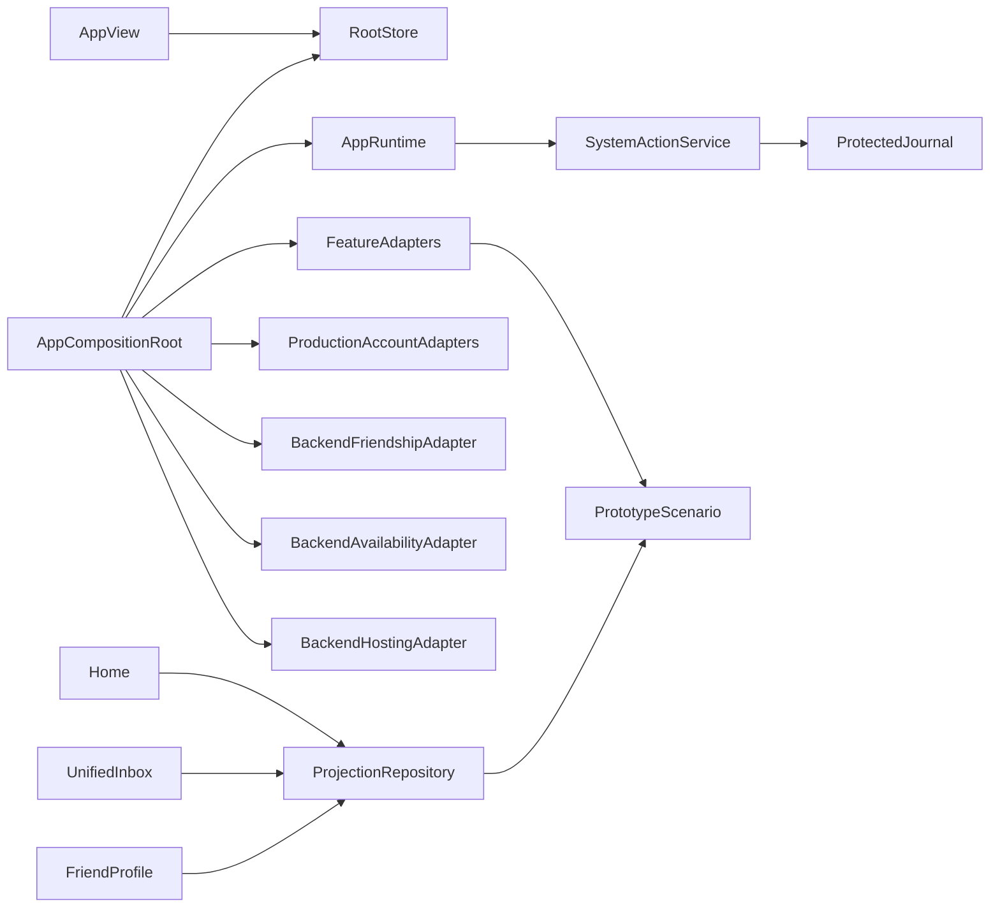

# Design Document

## Overview

`AppRuntime` が実Adapterと操作Clientを一度組み立て、`AppCompositionRoot` がそれらをTCA Storeへ注入する。Siriも同じ runtime を利用する。認証・プロフィール・削除・Friendship・本人の暇時間・Hosting は実Backend Adapterを標準とし、最初の内部TestFlightではSTGへ接続する。`HimatchPrototypeScenario` actorはDEBUGの明示的なデモと未接続機能だけに限定する。

起動時は削除受付状態とセッションを先に判定し、プロフィールの有無でメイン画面か初期設定画面を決める。プロフィール確定後はメイン画面を表示し、友達と本人の暇時間を独立した Effect で並行取得する。各取得状態は専用フラグで Home / Friends の領域に表示し、共通 `isLoading` の全面オーバーレイは読み取りに使わない。失敗時は各領域から再試行でき、片方の失敗で他方の表示を消さない。

## Boundary Commitments

### This Spec Owns

- Root Composition、横断 read model、共有 Prototype scenario、fixture reset、全機能統合テスト。

### Out of Boundary

- 個別機能の業務規則、暇と募集の実Backendトランザクション・API自体、Push。通常Debug/Release Adapter の注入は本仕様が所有する。明示デモだけPrototypeを利用する。

### Allowed Dependencies

- 新規5仕様の Domain / Application / Presentation 契約。Composition だけが Infrastructure 実装を参照できる。

### Revalidation Triggers

- 機能 Port、projection DTO、Root Navigation、fixture schema、TCA/Xcode の変更。

## Architecture


```mermaid
graph LR
    AppCompositionRoot --> RootStore
    AppCompositionRoot --> AppRuntime
    AppRuntime --> SystemActionService
    SystemActionService --> ProtectedJournal
    AppView --> RootStore
    AppCompositionRoot --> FeatureAdapters
    AppCompositionRoot --> ProductionAccountAdapters
    AppCompositionRoot --> BackendFriendshipAdapter
    AppCompositionRoot --> BackendAvailabilityAdapter
    AppCompositionRoot --> BackendHostingAdapter
    FeatureAdapters --> PrototypeScenario
    ProjectionRepository --> PrototypeScenario
    Home --> ProjectionRepository
    UnifiedInbox --> ProjectionRepository
    FriendProfile --> ProjectionRepository
```

## File Structure Plan

```text
apps/ios/Himatch/App/Composition/AppCompositionRoot.swift
apps/ios/Himatch/App/Composition/AppRuntime.swift
apps/ios/Himatch/App/Presentation/SystemActionHandoff.swift
apps/ios/Himatch/App/Presentation/SystemActionReviewView.swift
apps/ios/Himatch/App/Composition/AppProjectionRepository.swift
apps/ios/Himatch/App/Infrastructure/Prototype/HimatchPrototypeScenario.swift
apps/ios/Himatch/App/Presentation/AppFeature.swift
apps/ios/Himatch/App/Presentation/AppView.swift
apps/ios/HimatchTests/AppIntegration/
```

## Contracts

`AppProjectionRepository` は `home()`、`inbox()`、`friendPlans(friendID)` の read-only async 操作だけを持つ。DTO は ownerFeature と entityID を持ち、変更操作は Root delegate が所有機能へ route する。確定予定と `friendPlans` は DEBUG の Prototype fixture 専用とし、Release の投影には実 Backend の確定予定があるように表示しない。

`HimatchPrototypeScenario` は actor 内で全 fixture を保持し、feature adapter factory と reset(seed) を提供する。block/delete は actor メソッド一回で関連状態と revision を更新する。各 Adapter は自機能 Port だけを実装する facade である。

DEBUG の明示デモでは Composition が `demoClient` を Root へ注入し、`isDemo` のときだけ選択する。デモのプロフィール保存も Prototype を利用する。通常 Debug/Release と Siri の実Backend Client は維持する。

## Siri 操作との統合契約

システムからの入力・補完・再送は ios-siri-actions が所有し、Rootは入力を保持した認証後の復帰と表示を所有する。AppViewの初回起動、scene active、認証後のmain遷移、システム操作通知で、注入済みHandoff Clientを通じて未完了記録を検査する。JournalのcreatedAt順で一件ずつ表示し、完了後に次を取得する。再通知で表示中の入力を上書きしない。

本人識別はプロフィール通信の成功と分離し、復元済みsessionのuserIDへ引継ぎを束縛する。プロフィールGETが失敗しても本人不明の記録へ変換しない。本人変更・サインアウト・退会受付では旧本人のownerUserIDまたはentityOwnerUserIDに一致する準備済み操作とnil-ownerの未送信操作を失効させ、未送信記録を破棄する。送信済み不明結果は旧本人別に隔離して別アカウントに再送しない。成功後の暇・募集一覧はRootの独立した再取得を使う。Siri用の本人束縛Clientは募集作成・取消のmutation後GETを省略し、通常Root Clientは従来のsnapshot取得を維持する。

この実装と検証のタスクは [Siri実装計画](../ios-siri-actions/tasks.md) 2–7に集約し、本仕様へ重複した完了チェックを増やさない。実機SiriとSTG実アカウント検証の未実施を構造検査や単体テスト成功で代替しない。

## Requirements Traceability

| Requirement | Components | Validation |
|---|---|---|
| 1.1-1.4 | AppProjectionRepository, Root route | projection / navigation tests |
| 2.1-2.5 | HimatchPrototypeScenario, facets | actor / reset / cross-effect tests |
| 3.1-3.5 | AppCompositionRoot, integration tests | build / Swift Testing / Simulator smoke |
| 3.6-3.12 | ProductionAccountAdapters, BackendFriendshipAdapter, BackendAvailabilityAdapter, BackendHostingAdapter, AppFeature | composition / staging config / restore / invite response tests |

## Testing Strategy

- iOS テストは Swift Testing に統一し、repository verify で XCTest の再混入を拒否する。
- actor: reset、block/delete 原子的更新、revision。
- projection: owner ID、privacy-safe DTO、順序と区分。
- Root: delegate action が所有機能へ遷移する。
- Simulator: デモの主要経路。Backend安全性は MANUAL/BACKEND_REQUIRED として別判定する。
