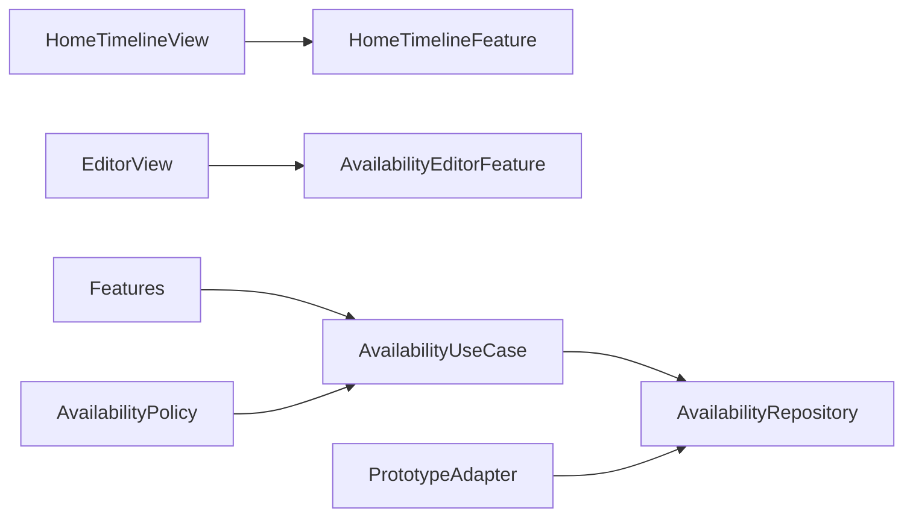

# Design Document

## Overview

Availability を独立機能として、Domain の `AvailabilitySlot` と `AvailabilityPolicy`、Application の Repository / UseCase、Infrastructure の Prototype Adapter、Presentation の HomeTimeline / AvailabilityEditor へ分ける。時間は `Date` の半開区間 `[start, end)` として扱う。

## Boundary Commitments

### This Spec Owns

- 自分の暇枠、公開ポリシー、入力検証、ホーム時間軸と編集シート。確定予定は Integration が提供する読み取り投影だけを表示する。

### Out of Boundary

- 他人への開示可否の最終判定、参加回答、確定予定のライフサイクル。

### Allowed Dependencies

- ios-app-foundation の Navigation / common UI、Foundation Calendar / TimeZone。

### Revalidation Triggers

- API の日時表現、対象期間、入力粒度、公開ポリシー、Hosting 参照契約の変更。

## Architecture



`AvailabilityPolicy` は15分境界、範囲、重複を純粋関数で検証する。Reducer は入力中の表示状態を所有し、保存判断を UseCase へ委譲する。

現行実装では Repository / UseCase は未実装で、保存は App の `HimatchClient.addAvailability` / `removeAvailability`（DEBUG は Prototype scenario）を Reducer の Effect から呼ぶ。Port 化はタスク1・2で行い、その際も下記の Presentation 契約は維持する。

### Domain ポリシー

`AvailabilityPolicy` は次の純粋関数を持ち、Presentation の初期値と入力補正はすべてこれを通す。

- `quarterHour`（15分）、`window`（14日）、`defaultDuration`（2時間）。
- `isQuarterHourAligned`：分が15の倍数で、秒とナノ秒が0。`validate` の `notQuarterHour` 判定に使う。
- `floorToQuarterHour`、`nextQuarterHour(after:)`（現在位置からの開始）、`latestEnd(now:)`（`now + 14日` を15分境界へ切り下げた登録可能な最終終了）。
- `draftInterval(anchor:now:)`：時間軸の位置を切り下げて開始とし、次の15分境界より前なら引き上げる。終了は `min(開始 + 2時間, latestEnd)`。15分も取れなければ nil。

### ホーム時間軸（HomeTimelineFeature）

- 今日の0時を起点とする14日（index 0〜13）を日表示と週表示で切り替える。週表示は今日から7日と次の7日の2ページとし、範囲外の日を表示しない。
- State は表示モード、起点日、選択日 index、選択中の項目、15分境界へ正規化済みの選択範囲と検証・保存状態を持つ。生の指位置と長押し進行状態は View の `@GestureState` に限定する。暇と予定のデータは親の snapshot から読み取り専用の `HomeScheduleItem`（自分の暇と確定予定のみ）として受け取る。これが現行の `HomeScheduleProjection` にあたる。
- 日付変更・タイムゾーン変更・表示時に `refreshWindow` で起点日を再計算し、選択中の日付を維持する。
- 日表示は1時間を44pt以上の行とする。タップは位置を含む15分だけを画面内で選択し、シートを開かない。時間軸上の透明な `UIViewRepresentable` が `UITapGestureRecognizer` と `UILongPressGestureRecognizer`（0.3秒・許容移動10pt）を1組だけ所有する。長押し成立後に上下へドラッグすると、開始位置と現在位置を含む範囲を `TimelineSelection.normalized` で15分境界へ合わせる。長押し前に動いた場合は祖先 `UIScrollView.panGestureRecognizer` が先に成立してタップと長押しを失敗させ、通常の縦スクロールを所有する。既存ブロックと選択ハンドルは透明面より上に配置する。
- 選択中は15分補助線、半透明の範囲、開始・終了ハンドル、開始・終了時刻と長さを重ねて表示する。ハンドルのドラッグも最寄りの15分境界へ合わせ、最低15分と1日境界を越えない。選択開始と境界変更に異なる触覚フィードバックを出す。
- 親は選択のたびに `AvailabilityPolicy.validate` を適用する。過去・14日範囲外・重複は選択を消さず、破線、警告アイコン、理由テキストで示して登録を無効にする。保存直前にも時計と既存枠で再検証する。
- 有効な選択では下部確認バーに範囲、長さ、「参加OKまで非公開」を表示する。「非公開で登録」はカテゴリ nil・`privateUntilAccepted` で保存し、「詳細を調整」は同じ範囲を編集シートへ渡す。選択だけでは保存せず、成功時だけ選択を消し、失敗時は再試行用に保持する。
- VoiceOver では行ごとの :00 を既定アクション、:15/:30/:45 をカスタムアクションとして提供し、選択範囲には開始・終了を15分ずつ調整するアクション、登録、詳細調整、取消を提供する。週表示の時刻セルは該当日の日表示へ移り15分を選択する。アクセシビリティ文字サイズでは週表示を日ごとの一覧へ切り替える。
- 常設の「暇を登録」だけは delegate `startAvailability(anchor: nil)` で親へ通知し、次の15分境界から2時間の編集状態を作る。
- 既存の暇をタップすると詳細（範囲・公開設定・削除）を表示する。削除は関連する回答や予定を削除しないことを明示し、delegate `removeAvailability` で親へ渡す。
- 日付をまたぐ枠は日ごとに半開区間で切り分け、重なる暇と予定は横に並べる（`TimelineLayout`）。

### 暇の編集シート（AvailabilityEditorFeature）

- 開始と終了を絶対時刻で保持し、上部の要約（開始→終了、日付、長さ、日付またぎ、表示タイムゾーン）を入力のたびに更新する。
- 開始・終了それぞれに ±15分ボタンと15分刻みの日時ピッカー（`UIDatePicker.minuteInterval = 15`）を置き、受け取った値は Reducer で15分境界へ切り下げる。開始の移動は長さを保ち、終了は `開始 + 15分` から `latestEnd` の範囲に収める。
- 長さプリセットは15分・30分・1時間・2時間・3時間・6時間。`latestEnd` を超えるものは無効にする。
- 検証結果は `AvailabilityPolicy.validate` を毎回評価して時間の直下に表示し、無効な間は保存しない。重複は「重なっている暇を見る」で編集を閉じて既存枠の日と詳細へ移動する。開始が過ぎた場合は次の15分へ合わせる操作を出す。
- 時計は `@Dependency(\.date)` から取得し、各操作と保存直前に再評価する。新規枠の id は `@Dependency(\.uuid)` で作る。
- 公開設定は説明付きの2択で、編集状態は開くたびに作り直すため常に「参加OKするまで非公開」から始まる。暇登録が参加OKや予定確定ではないことを明記する。
- 保存失敗時は入力を保持し、理由を表示して再試行できる。

## File Structure Plan

```text
apps/ios/Himatch/Availability/
├── Domain/AvailabilityModels.swift              # 実装済み：モデルと AvailabilityPolicy
├── Application/Port/AvailabilityRepository.swift # 未実装（タスク1）
├── Application/UseCase/ManageAvailability.swift  # 未実装（タスク1）
├── Infrastructure/Adapter/PrototypeAvailabilityAdapter.swift # 未実装（タスク2）
└── Presentation/
    ├── Reducer/HomeTimelineFeature.swift
    ├── Reducer/AvailabilityEditorFeature.swift
    ├── Component/{TimelineLayout,TimelineSelection,AvailabilityFormatting,QuarterHourDatePicker}.swift
    └── View/{HomeTimelineView,TimelineGridViews,TimelineSelectionViews,AvailabilityEditorView}.swift
apps/ios/Himatch/App/Presentation/Screens/HomeView.swift  # snapshot → HomeScheduleItem の写像と Home の合成
apps/ios/HimatchTests/Availability/
apps/ios/HimatchTests/Domain/AvailabilityPolicyTests.swift
```

`TimelineLayout.swift` は `HomeScheduleItem`（HomeScheduleProjection の現行形）を定義する。共通の色・余白・ボタン部品は `App/Presentation/DesignSystem/` を使う。

## Data Model and Contracts

- `AvailabilitySlot`: id、start、end、optional category、visibility、version。
- `AvailabilityVisibility`: `privateUntilAccepted` / `shareOnHosting`。
- Repository: list(range)、create(command,idempotencyKey)、update(id,version,command)、delete(id,version)。
- `AvailabilityError`: invalidInterval、past、outsideWindow、overlap(existingID)、conflict、transport。
- `HomeScheduleProjection` は Availability と Hosting の表示用項目を Integration から受け取る読み取り契約で、確定予定の変更を提供しない。

重複判定は `new.start < existing.end && existing.start < new.end`。過去判定と14日上限の時計は注入し、テストを決定的にする。

## Requirements Traceability

| Requirement | Components | Validation |
|---|---|---|
| 1.1-1.7 | HomeTimelineFeature, TimelineLayout, TimelineSelection, HomeView | reducer / selection / layout tests, gesture inspection |
| 2.1-2.7 | AvailabilityPolicy, AvailabilityEditorFeature, AppFeature | policy / TestStore |
| 3.1-3.4 | Visibility, AvailabilityEditorFeature | state / copy tests |
| 4.1-4.4 | ManageAvailability, AvailabilityEditorFeature | repository conflict tests, save failure TestStore |
| 5.1-5.4 | AvailabilityFormatting, day/week controls, selection overlay | timezone / accessibility / feedback inspection |

## Error and Testing Strategy

- 入力エラーは項目近傍、競合は最新取得後の再確認、通信失敗は入力保持。
- Domain: 15分境界（秒を含む）、最短15分、日付またぎ、現在と14日の境界、半開区間の重複、初期枠、タイムゾーン変更。
- Application: Repository 成功・競合・再送。
- Presentation: タップで15分、上下ドラッグの正規化、日境界、ハンドル調整、長押し閾値、保存直前の再検証、直接登録、詳細への同一範囲引継ぎ、失敗時の選択保持、日／週の移動範囲、公開説明、削除と Hosting 導線。
- Integration: Home の直接選択から非公開登録または編集シートへの引継ぎ、保存後の該当日表示、重複から既存枠への移動（AppFeature TestStore）。実機相当の長押しドラッグ、スクロール競合、VoiceOver は Simulator 手動確認の対象とする。
