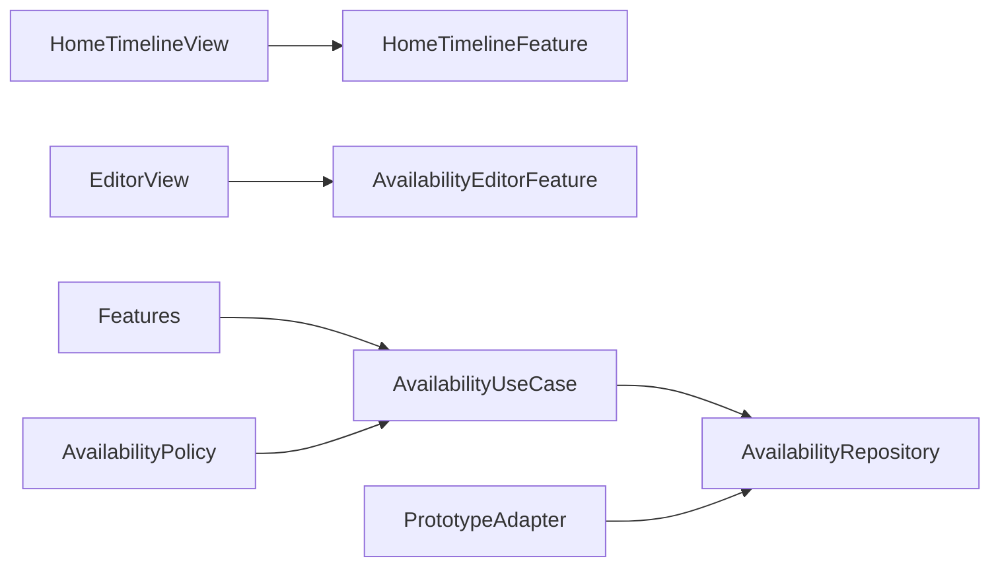

# Design Document

## Overview

Availability を独立機能として、Domain の `AvailabilitySlot` と `AvailabilityPolicy`、Application の Repository / UseCase、Infrastructure の Prototype Adapter、Presentation の HomeTimeline / AvailabilityEditor へ分ける。時間は `Date` の半開区間 `[start, end)` として扱う。

## Boundary Commitments

### This Spec Owns

- 自分の暇枠、公開ポリシー、入力検証、ホーム時間軸と編集シート。確定予定は Integration が提供する読み取り投影だけを表示する。

### Out of Boundary

- 他人への開示可否の最終判定、参加回答、確定予定のライフサイクル。

### Allowed Dependencies

- ios-app-foundation の Navigation / common UI、Foundation Calendar / TimeZone。

### Revalidation Triggers

- API の日時表現、対象期間、入力粒度、公開ポリシー、Hosting 参照契約の変更。

## Architecture



`AvailabilityPolicy` は15分境界、範囲、重複を純粋関数で検証する。Reducer は入力中の表示状態を所有し、保存判断を UseCase へ委譲する。

## File Structure Plan

```text
apps/ios/Himatch/Availability/
├── Domain/Model/AvailabilitySlot.swift
├── Domain/Policy/AvailabilityPolicy.swift
├── Application/Port/AvailabilityRepository.swift
├── Application/UseCase/ManageAvailability.swift
├── Application/Port/HomeScheduleProjection.swift
├── Infrastructure/Adapter/PrototypeAvailabilityAdapter.swift
└── Presentation/
    ├── Reducer/HomeTimelineFeature.swift
    ├── Reducer/AvailabilityEditorFeature.swift
    └── View/{HomeTimelineView,AvailabilityEditorView}.swift
apps/ios/HimatchTests/Availability/
```

## Data Model and Contracts

- `AvailabilitySlot`: id、start、end、optional category、visibility、version。
- `AvailabilityVisibility`: `privateUntilAccepted` / `shareOnHosting`。
- Repository: list(range)、create(command,idempotencyKey)、update(id,version,command)、delete(id,version)。
- `AvailabilityError`: invalidInterval、past、outsideWindow、overlap(existingID)、conflict、transport。
- `HomeScheduleProjection` は Availability と Hosting の表示用項目を Integration から受け取る読み取り契約で、確定予定の変更を提供しない。

重複判定は `new.start < existing.end && existing.start < new.end`。過去判定と14日上限の時計は注入し、テストを決定的にする。

## Requirements Traceability

| Requirement | Components | Validation |
|---|---|---|
| 1.1-1.4 | HomeTimelineFeature | reducer / view smoke |
| 2.1-2.5 | AvailabilityPolicy, Editor | policy / TestStore |
| 3.1-3.4 | Visibility, Editor | state / copy tests |
| 4.1-4.4 | ManageAvailability | repository conflict tests |
| 5.1-5.3 | time formatter, controls | timezone / accessibility inspection |

## Error and Testing Strategy

- 入力エラーは項目近傍、競合は最新取得後の再確認、通信失敗は入力保持。
- Domain: 境界、日付またぎ、重複、タイムゾーン変更。
- Application: Repository 成功・競合・再送。
- Presentation: 初期値、公開説明、削除と Hosting 導線。
- Integration: Home から新規・編集・削除の一連操作。
