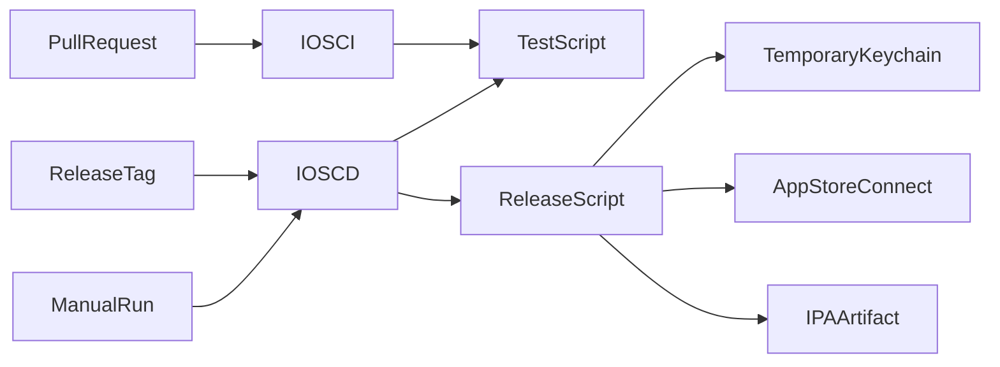

# Design Document

## Overview

最小の SwiftUI アプリと shared scheme を CI の実行対象として追加し、GitHub Actions で署名不要の Simulator test を行う。配布は別 workflow で同じ test を通過した後に一時 keychain へ署名素材を展開し、IPA を App Store Connect へアップロードする。

### Goals

- Xcode project が存在する現在状態で CI を成功可能にする。
- pull request と配布 secret を分離する。
- 外部設定不足を archive 前に具体的なエラーで検出する。

### Non-Goals

- TCA、Backend client、製品機能の導入。
- App Store review の申請、段階公開、公開後ロールバックの自動化。
- Apple Developer と GitHub の外部画面操作の自動化。

## Boundary Commitments

### This Spec Owns

- `Himatch` app/test target と shared scheme。
- iOS build/test script、署名・export・upload script。
- iOS CI と TestFlight CD workflow。
- 資格情報名と外部設定 runbook。

### Out of Boundary

- アプリの製品機能と設計層。
- Backend OpenAPI の生成と互換性。
- App Store metadata、審査回答、公開操作。

### Allowed Dependencies

- Xcode 26.6 の `xcodebuild`、`security`、`plutil`、`altool`。
- GitHub `macos-26` image 同梱の Python 3.14 系と OpenSSL 3.6 系。ローカルでは Python 3.9 以上、OpenSSL 3.4 以上。
- GitHub-hosted `macos-26` runner、公式 checkout/upload-artifact actions。
- Apple Developer Program と App Store Connect。

### Revalidation Triggers

- Xcode または GitHub macOS image の変更。
- Python または OpenSSL の major/minor version、鍵詳細出力形式の変更。
- Bundle ID、Team ID、capability、entitlement の変更。
- 証明書、profile、API key の更新または失効。
- target、scheme、App Store upload 要件の変更。

## Architecture



秘密を参照しない `TestScript` を CI/CD の共通ゲートにし、秘密を扱う `ReleaseScript` は `testflight` Environment の job からだけ呼び出す。

### Technology Stack

| Layer | Choice / Version | Role | Notes |
|---|---|---|---|
| iOS | Swift 6.3 / SwiftUI / iOS 17+ | 最小 app と XCTest | TCA は未導入 |
| Build | Xcode 26.6 | test、archive、export | App Store の Xcode 26+ 要件に適合 |
| CI/CD | GitHub Actions macOS 26 | PR 検証と TestFlight 配布 | workflow を分離 |
| Upload | `xcrun altool` + App Store Connect API key | IPA upload | Apple ID password は使わない |

## File Structure Plan

```text
apps/ios/
├── Himatch.xcodeproj/
├── Himatch/
│   ├── HimatchApp.swift
│   ├── ContentView.swift
│   └── Assets.xcassets/AppIcon.appiconset/
└── HimatchTests/HimatchTests.swift
scripts/ios/
├── test.sh
├── release.sh
├── validate_signing_assets.py
└── tests/test_validate_signing_assets.py
.github/workflows/
├── ci-ios.yml
└── cd-ios-testflight.yml
```

`test.sh` は秘密を受け取らず、署名素材検査の異常系 unit test と Xcode test を実行する。
`release.sh` は workflow の archive step から渡された環境変数だけを利用し、`validate_signing_assets.py` で archive 前に検証する。

## Requirements Traceability

| Requirement | Summary | Components | Interfaces | Flows |
|---|---|---|---|---|
| 1.1-1.4 | PR/main 検証 | iOSProject, TestScript, IOSCI | shell exit status | PullRequest → IOSCI |
| 2.1-2.5 | TestFlight 配布 | IOSCD, ReleaseScript | Environment values, IPA | ReleaseTag → AppStoreConnect |
| 3.1-3.4 | 秘密と運用境界 | ReleaseScript, GitIgnore, Runbook | secret/variable names | Environment → ReleaseScript |
| 4.1-4.3 | 文書整合 | ProjectDocs | documented commands | 実装 → 文書同期 |

## Components and Interfaces

| Component | Intent | Requirements | Dependencies |
|---|---|---|---|
| iOSProject | 実際に build/test/archive できる最小 app | 1.1, 2.1 | Xcode |
| TestScript | CI/CD 共通の署名なし test | 1.1-1.3, 2.1 | shared scheme |
| ReleaseScript | preflight、署名、export、upload、cleanup | 2.2-2.5, 3.2 | Apple assets |
| IOSCI | PR/main の検証起動 | 1.1-1.4 | macos-26 |
| IOSCD | tag/manual 配布と Environment 境界 | 2.1-2.5, 3.3 | testflight Environment |
| Runbook | 人が行う外部設定 | 3.4, 4.1-4.3 | Apple/GitHub UI |

### ReleaseScript batch contract

- **Trigger**: `cd-ios-testflight.yml` の release job。
- **Inputs**: certificate/profile/API key の Base64 secrets、Team/Bundle/Issuer/Key ID variables、marketing/build version。
- **Validation**: 必須値、厳密な ID 形式、Base64 decode、証明書と秘密鍵の対応、証明書と profile の対応、両者の有効期限、profile の Team ID と application identifier、API private key の parse と ES256 用 EC P-256 curve。
- **Output**: signed IPA、App Store Connect upload result。
- **Recovery**: cleanup trap で keychain/profile/key を削除。失敗後は原因を直し、同じ version と新しい build number で再実行する。

## Security and Validation

- PR job には Environment を付けず、secret context を参照しない。
- release job の token permission は `contents: read` のみ。
- context 値は shell command へ直接埋め込まず、environment variable として渡す。
- repository 検査、signing preflight の異常系単体テスト、generic Simulator build、XCTest、workflow 構文、secret-like file の非追跡を検証する。

## Open Questions / Risks

- 実 Bundle ID、Team、App Store Connect app record、証明書/profile/API key は repository 外でユーザーが作成する。
- `testflight` の required reviewer は GitHub plan によって private repository で利用できない場合がある。その場合も Environment 分離、tag/manual trigger、branch/tag rule を適用する。
