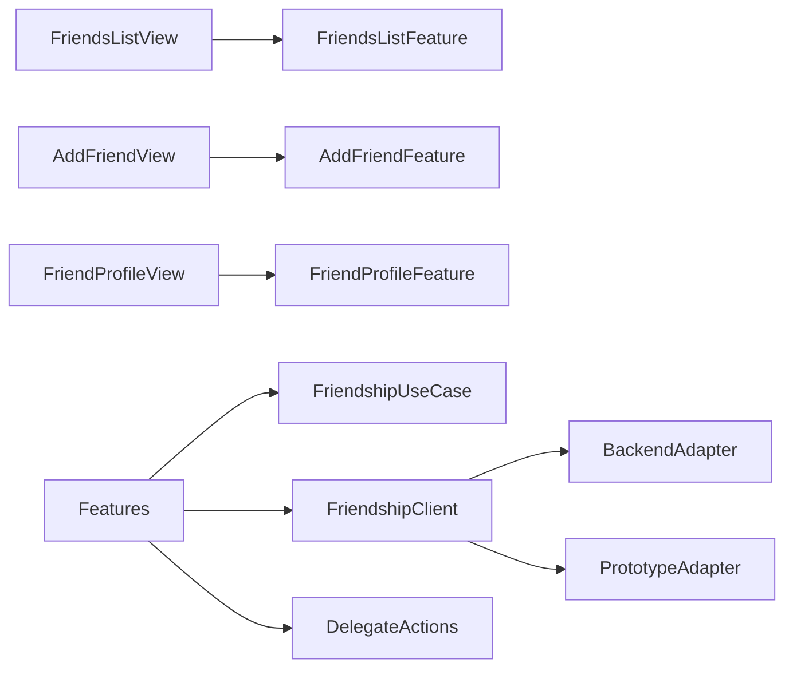

# Design Document

## Overview

Friendship が関係と申請のクライアント状態を所有し、一覧、コード入力、プロフィールを TCA 状態として構成する。Release は build-time configuration が指す Backend Friendship API（最初の内部 TestFlight は STG）、DEBUG デモは共有 Prototype scenario を利用する。安全操作と募集作成へは ID を渡す Navigation delegate のみ公開する。

## Boundary Commitments

### This Spec Owns

- 友達、受信・送信申請、招待コード、プロフィール、解除の iOS 契約と状態、および実 Backend Adapter。最初の Release build は STG を接続先とする。

### Out of Boundary

- ブロックの適用、通報保存、募集、コード生成の安全性、友達グラフのサーバー認可。

### Allowed Dependencies

- ios-app-foundation の Navigation / common UI、backend-friendship の公開 HTTP 契約。

### Revalidation Triggers

- 友達状態、コード契約、プロフィール公開項目、Safety / Hosting delegate の変更。

## Architecture



## File Structure Plan

```text
apps/ios/Himatch/Friendship/
├── Domain/Model/{Friendship,FriendRequest,InviteCode}.swift
├── Domain/Policy/FriendshipPolicy.swift
├── Application/Port/FriendshipClient.swift
├── Application/Port/FriendPlanProjection.swift
├── Infrastructure/Adapter/BackendFriendshipAdapter.swift
└── Presentation/
    ├── Reducer/{FriendsList,AddFriend,FriendProfile}Feature.swift
    └── View/{FriendsList,AddFriend,FriendProfile}View.swift
apps/ios/HimatchTests/Friendship/
```

## State and Contracts

- `FriendshipStatus`: friends / incoming / outgoing は別コレクションではなく1状態の投影とする。
- `FriendshipClient`: snapshot、resolveCode、sendRequest、accept、reject、cancel、remove、rotateCode。実 Backend 操作は access token を明示的に受け取る。
- 変更入力は operationID と expectedVersion を持つ。
- `FriendshipError`: unavailableCode、conflict、permissionLost、transport。コードの詳細理由は外へ出さない。

FriendProfile の delegate は `invite(friendID)`、`report(target)`、`block(userID)`、`openPlan(planID)`。他機能の View や Adapter を import しない。
`FriendPlanProjection` は Integration が提供する read-only 契約で、確定予定の有無と plan ID だけを返す。Friendship は予定を変更しない。

## Requirements Traceability

| Requirement | Components | Validation |
|---|---|---|
| 1.1-1.5 | FriendsListFeature | state / conflict tests |
| 2.1-2.4 | AddFriendFeature, InviteCode | privacy / reducer tests |
| 3.1-3.5 | FriendProfileFeature | delegate / permission tests |
| 4.1-4.3 | Repository, docs handoff | idempotency / review |
| 5.1-5.7 | BackendFriendshipAdapter, AppFeature, Composition | adapter / reducer / integration tests |

## Testing Strategy

- Domain: 状態遷移、自己申請・重複申請の拒否。
- Application: code 共通エラー、operationID、version conflict。
- Presentation: 3区分、空・失敗、プロフィール delegate、入力保持。
- Integration: code → profile → request → accept → friend。
- Infrastructure: HTTP DTO、Bearer token、共通 code error、409 conflict の変換。
