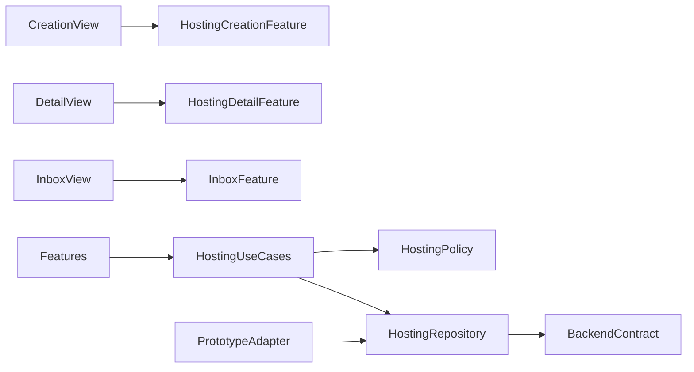
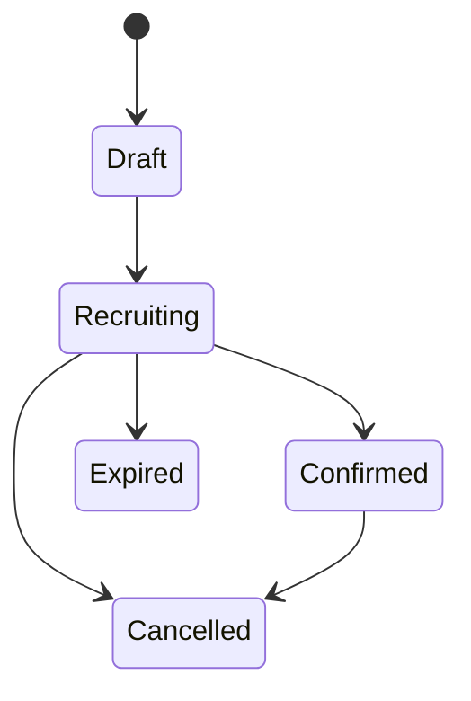

# Design Document

## Overview

Hosting Domain が募集、回答、確定予定を別エンティティとして所有し、Application が時間区間演算と Repository の操作時整合性を調整する。Presentation は HostingCreation、HostingDetail、Inbox の3境界を持ち、役割と状態に応じて操作を切り替える。

## Boundary Commitments

### This Spec Owns

- iOS の募集・回答・予定状態、時間共通部分、漏えいしない表示 DTO、受信箱。

### Out of Boundary

- 候補探索と認可のサーバー実装、Push、レート制限、運営処理、自由投稿。

### Allowed Dependencies

- AppFoundation、Availability の区間、Friendship の friend ID。ブロック検査は `HostingRepository.confirm` のサーバー前提条件結果へ閉じ込め、Safety へ静的依存しない。

### Revalidation Triggers

- Hosting API、状態 enum、公開レスポンス、回答者公開範囲、確定条件、Safety / Availability 契約の変更。

## Architecture



BackendContract は将来の API の期待契約であり、本仕様では Prototype Adapter の外へ通信しない。Repository response は invited count、non-responder identity、availability reason を持たない。

## File Structure Plan

```text
apps/ios/Himatch/Hosting/
├── Domain/Model/{Hosting,ParticipationResponse,ConfirmedPlan}.swift
├── Domain/Policy/{TimeIntersectionPolicy,HostingTransitionPolicy}.swift
├── Application/Port/HostingRepository.swift
├── Application/UseCase/{CreateHosting,RespondToInvitation,ConfirmPlan,ManagePlan}.swift
├── Infrastructure/Adapter/PrototypeHostingAdapter.swift
└── Presentation/
    ├── Reducer/{HostingCreation,HostingDetail,Inbox}Feature.swift
    └── View/{HostingCreation,HostingDetail,Inbox}View.swift
apps/ios/HimatchTests/Hosting/
```

## Domain Model

- `Hosting`: id、hostID、mode、category、area、candidateRange、requiredDuration、friendIDs、deadline、status、version。
- `HostingArea`: 定義済みエリアまたは `discussLater`。online では nil、offline では必須。
- `ParticipationResponse`: hostingID、responderID、approvedIntervals、status、version。
- `ConfirmedPlan`: hostingID、interval、participantIDs、status、version。
- すべての時間は半開区間。回答の approvedIntervals は候補期間内かつ本人の選択だけ。



## Application Contracts

`HostingRepository` は `create(command, operationID)`、`detail(id)`、`respond(command, operationID, expectedVersion)`、`confirm(command, operationID, expectedVersion)`、`cancel`、`leave`、`inbox(section)` を提供する。

Privacy response rules:

- create response は hosting ID / status / deadline のみで配信人数を返さない。
- host detail は `sharedAvailability` と参加 OK の回答者を別投影で含む。前者は募集時共有を明示した友達と重複部分だけ、後者は承認済み回答だけを含み、非公開招待者・未回答・初回見送りを列挙しない。
- invitee detail は本人が回答可能な候補だけを含む。
- confirmed detail は確定参加者にだけ日時・内容・参加者名を含む。

`TimeIntersectionPolicy` はホストと参加 OK 全員の intervals を交差し、requiredDuration 以上の連続候補を15分境界で返す。最終確定は Repository の precondition 結果を正本とする。

## Requirements Traceability

| Requirement | Components | Validation |
|---|---|---|
| 1.1-1.6 | HostingCreationFeature | step / validation tests |
| 2.1-2.5 | privacy response contracts | contract-shape tests |
| 3.1-3.6 | HostingDetail invitee | reducer / expiry tests |
| 4.1-4.6 | TimeIntersectionPolicy, confirm | interval / conflict tests |
| 5.1-5.6 | transition policy, detail | state transition tests |
| 6.1-6.4 | InboxFeature | push-independent smoke |
| 7.1-7.4 | repository commands | idempotency / ambiguity tests |

## Error and Testing Strategy

- business errors: expired、noCommonTime、blockedCombination、scheduleConflict、versionConflict。
- permission lost は詳細を破棄して一覧へ戻す。transport ambiguous は operationID を保持する。
- Domain: 交差、必要時間、境界、全状態遷移。
- Application: privacy DTO、operationID、確定 preflight。
- Presentation: 3段階作成、役割別詳細、受信箱、Pushなしフロー。
- Integration: 暇 fixture → 募集 → 回答 → 確定 → 離脱／取消。

## Security Considerations

UIで隠すだけでは Q-01/Q-02 を満たさない。API 実装時は認可済み projection を返し、iOS は内部モデルや他人の暇枠を受け取らない。通常ログへ候補時間や credential を出さない。
