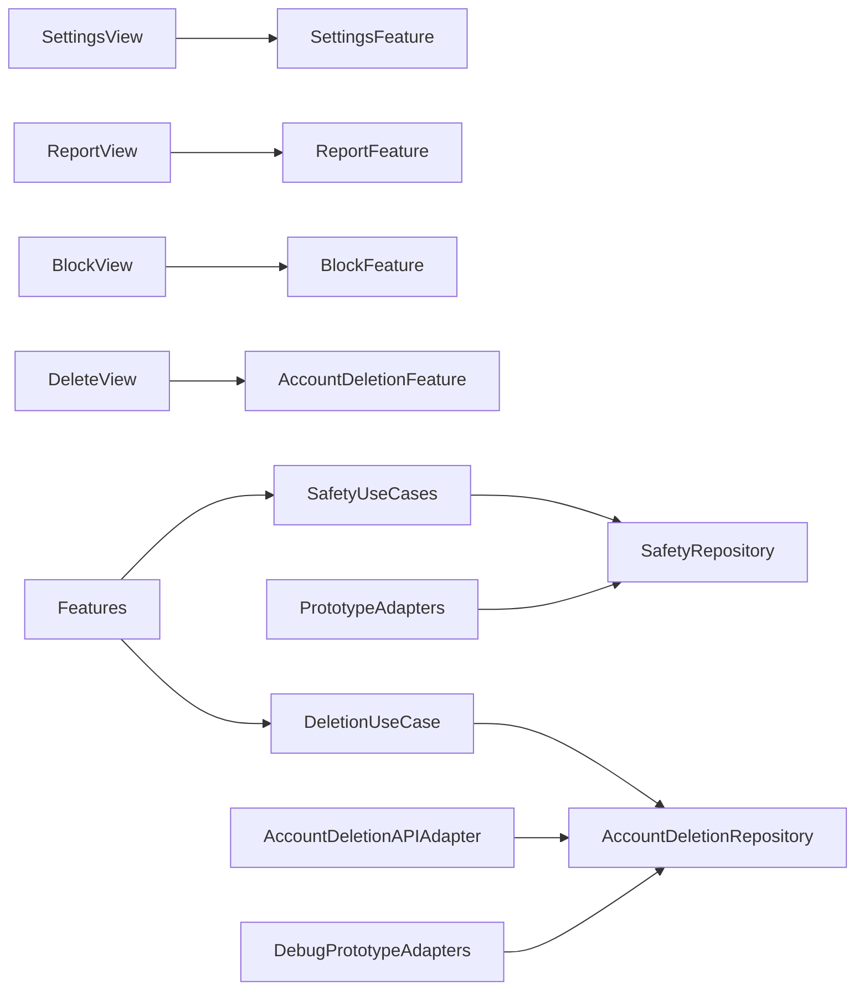

# Design Document

## Overview

Safety、NotificationSettings、AccountDeletion を Application 境界として分け、Settings はそれらへの Navigation を合成する。通報とブロックは独立コマンド、ブロックは preview → confirm、削除は accepted → processing → completed / actionRequired の長期状態として表す。

## Boundary Commitments

### This Spec Owns

- iOS の通報、ブロック確認、通知設定、設定、文書導線、削除受付・状況表示。

### Out of Boundary

- 運営是正、APNs、Backend内部のApple token revoke・Auth user削除、バックアップ墓石、法的保持。

### Allowed Dependencies

- AppFoundation の suspension、Friendship / Hosting の対象 ID と Navigation contract、UserNotifications の OS 設定導線。

### Revalidation Triggers

- UGC ガイド、削除ガイド、block preview、report、deletion status、通知カテゴリの変更。

## Architecture



## File Structure Plan

```text
apps/ios/Himatch/Safety/
├── Domain/Model/{Report,BlockImpact}.swift
├── Application/Port/SafetyRepository.swift
├── Application/UseCase/{SubmitReport,ManageBlock}.swift
├── Infrastructure/Adapter/PrototypeSafetyAdapter.swift
└── Presentation/{Reducer,View}/
apps/ios/Himatch/AccountDeletion/
├── Domain/Model/AccountDeletionStatus.swift
├── Application/{Port,UseCase}/
├── Infrastructure/Adapter/{API,Prototype}AccountDeletionAdapter.swift
└── Presentation/{Reducer,View}/
apps/ios/Himatch/Settings/Presentation/{Reducer,View}/
apps/ios/Himatch/Settings/Application/Port/NotificationSettingsRepository.swift
apps/ios/Himatch/Settings/Infrastructure/Adapter/PrototypeNotificationSettingsAdapter.swift
apps/ios/HimatchTests/{Safety,AccountDeletion,Settings}/
```

## State and Contracts

- `ReportTarget`: user(userID, contextID?) / hosting(hostingID, userID?)。
- `ReportReason`: fixed enum。補足は500 grapheme以下。
- `BlockImpact`: relationship、pendingInteractions、confirmedPlans の件数と表示用要約、version。ブロック関係そのものは他参加者向け文言に含めない。
- `BlockResult`: 更新済み friendship ID、hosting ID、plan ID と外部向け安全な結果要約。完了後に Integration の各投影を再取得する。
- `AccountDeletionStatus`: idle、confirmingImpact、reauthenticating、submitting、accepted(reference, estimate)、processing、completed、actionRequired(reference, message)。fresh Apple再認証からauthorization codeを取得し、UUIDの冪等キーとともにBackendへ送る。
- `NotificationSettingsRepository`: load、save(settings, operationID)、systemAuthorizationStatus。アプリ内購読設定と OS 許可状態を別フィールドにする。
- Repository command は operationID / expectedVersion を持つ。ambiguous transport は同じ operationID で照会する。

設定の文書 URL は構成値とし、空・無効 URL をリリース検証で失敗させる。本実装では到達先の準備状態を文書化し、架空 URL を有効と見せない。

## Requirements Traceability

| Requirement | Components | Validation |
|---|---|---|
| 1.1-1.5 | ReportFeature | target / retry tests |
| 2.1-2.6 | BlockFeature, BlockImpact, BlockResult | preview / conflict / projection reload tests |
| 3.1-3.6 | NotificationSettingsFeature, NotificationSettingsRepository | permission-independent / persistence tests |
| 4.1-4.4 | SettingsFeature, docs | navigation / content review |
| 5.1-5.7 | AccountDeletionFeature | lifecycle / failure tests |
| 6.1-6.4 | value validation, safety adapter | enum / suspension tests |

## Testing Strategy

- Domain/Application: 500文字、fixed enum、block preview version、deletion lifecycle、ambiguous retry。
- Presentation: 対象自動設定、通報成功・失敗、ブロック影響再確認、設定一覧、削除受付。
- Integration: 招待詳細から通報、プロフィールからブロック、設定から削除、利用停止中の許可画面。
- Backend integration: Apple本人照合、token revoke、Supabase hard delete、actionRequired。
- Manual required: 実Apple/Supabase staging、APNs、運営是正、通知本文。

## Security Considerations

- 通報補足、暇、credential を通常ログへ出さない。
- Push は opaque な更新通知だけを使い、詳細は認証・認可後に取得する。
- アクセス停止と削除完了を別状態にし、外部処理失敗で再ログインを許さない。
