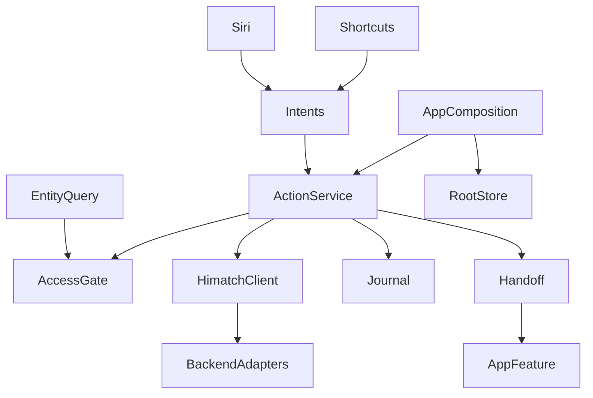
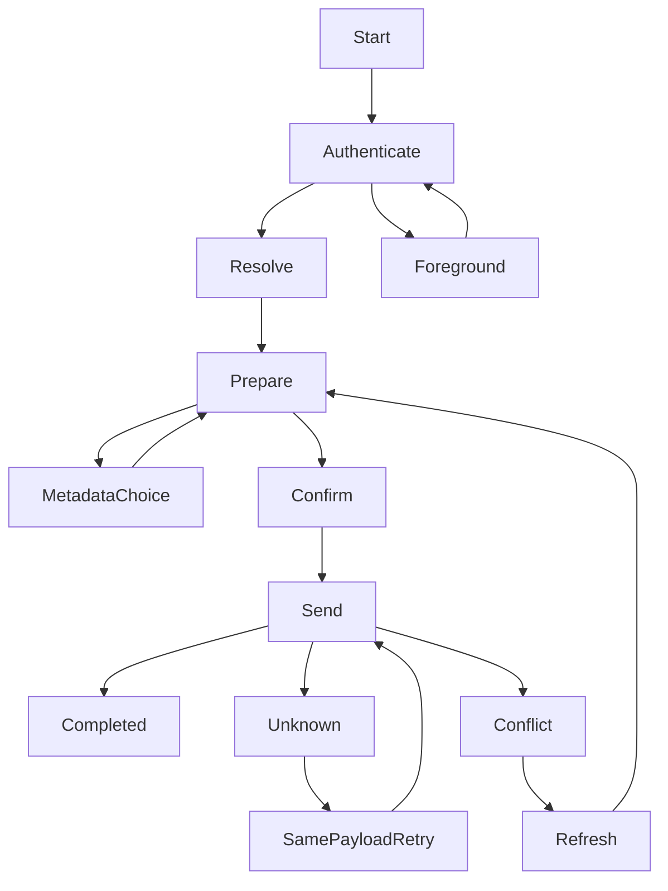

# Design Document

## Overview

4つの App Intent を本体アプリに組み込み、Siri とショートカットの両方へ公開する。通常は画面を開かずに登録・削除・募集・取消を完了し、ログイン、属性統合の選択、競合解消、通信再試行などが必要なときだけ入力を保ってアプリへ引き継ぐ。設計の生成・レビューは設計承認と区別する。[^siri-requirements]

既存の `HimatchClient` と Backend Adapter を使う。新しい HTTP API や Siri 専用の業務ルールは作らない。Production Composition の組立てを共通の AppRuntime へ抽出し、Root Store とシステム操作に同じ実依存を注入する。DEBUG のデモ Store を Siri の操作先に使わない。Debug/Release とも通常起動の Store は共通実依存を使い、Prototype は利用者が明示的にデモを開始したときだけ注入する。Siri 引継ぎは Service と本人束縛 Client を使う専用画面で実行し、デモ表示からの変更として扱わない。

## Boundary Commitments

### This Spec Owns
- システムの Intent、パラメータ、対象 Entity、応答、操作の準備・確認・実行・再送の制御。
- 確定済み入力のアプリ引継ぎと、そのための最小限の保護された操作記録。

### Out of Boundary
- 暇のOR統合、募集と本人暇の原子的登録、認可、operationID のサーバー側冪等性は既存 Backend の責務。
- 参加回答、予定確定、他人の暇検索、公開範囲の自動拡大は公開しない。

### Allowed Dependencies
- `SystemActions/Application` は Foundation と既存 Domain 型・Client の操作契約へ依存する。
- `SystemActions/Infrastructure/AppIntents` は AppIntents と Application へ依存し、TCA Store や API Adapter を生成しない。
- `App/Composition` が認証、プロフィール、友達、暇、募集、保護ストレージを組み立てる。Root Presentation は引継ぎと表示更新だけを担当する。
- 現在 `HimatchClient` は `App/Domain` に配置される。今回その配置を横断移設せず、既存の操作契約として再利用する。

### Revalidation Triggers
App Intents の SDK、iOS の最低版、認証復元、退会受付判定、AppFeature の起動ルート、Client、日時・属性統合、API の操作ID・version契約が変わったときに再検証する。

## Architecture



| 領域 | 採用する技術 | 役割 |
|---|---|---|
| システム公開 | App Intents、iOS 17 以降 | Intent、App Shortcuts、Entity Query、補完・確認 |
| 既存画面 | SwiftUI、既存 TCA 1.26.1、Swift 6 | 認証後ルーティングと再取得 |
| 操作制御 | Swift actor と Sendable の値 | 実行の排他、同一操作の再送、アカウント境界 |
| ローカル記録 | Foundation の原子的ファイル書込、完全保護 | 入力と未確定結果の復元 |
| 通信 | 既存 Client、Supabase 認証、Backend Adapter | 既存 API の実行 |

新しい外部パッケージ、拡張ターゲット、App Group、SiriKit entitlement は追加しない。Intent は本体ターゲットに含める。App Intents のメタデータ抽出と App Shortcuts の生成をビルドで検査する。

## File Structure Plan

### New Files
- `apps/ios/Himatch/SystemActions/Domain/SystemActionModels.swift`: 開始・終了・タイムゾーン、操作種別、確定入力、結果・失敗。
- `apps/ios/Himatch/SystemActions/Application/SystemActionService.swift`: アクセス検証、準備・実行・同一操作再送を行う actor。
- `apps/ios/Himatch/SystemActions/Application/SystemActionDependencies.swift`: 認証・データ取得・保護記録・日時と UUID の注入契約。
- `apps/ios/Himatch/SystemActions/Infrastructure/AppIntents/AvailabilityIntents.swift`: 暇登録と範囲削除。
- `apps/ios/Himatch/SystemActions/Infrastructure/AppIntents/HostingIntents.swift`: 募集作成と取消。
- `apps/ios/Himatch/SystemActions/Infrastructure/AppIntents/SystemActionEntities.swift`: FriendEntity、OwnedHostingEntity、Query、固定選択 AppEnum。
- `apps/ios/Himatch/SystemActions/Infrastructure/AppIntents/AppShortcuts.xcstrings`: 日本語の起動フレーズ。
- `apps/ios/Himatch/SystemActions/Infrastructure/AppIntents/HimatchAppShortcuts.swift`: 4操作の日本語フレーズとタイトル。
- `apps/ios/Himatch/SystemActions/Infrastructure/Storage/SystemActionJournal.swift`: 完全保護ファイルの読み書き・削除。
- `apps/ios/Himatch/App/Composition/AppRuntime.swift`: Store と Intent が共有する実依存の生成・保持。
- `apps/ios/Himatch/App/Presentation/SystemActionHandoff.swift`: MainActor の引継ぎ通知と Root の依存契約。
- `apps/ios/Himatch/App/Presentation/SystemActionReviewView.swift`: 保持済み入力の確認、属性選択、既知失敗の再準備、結果不明の同一操作再送。
- `apps/ios/HimatchTests/SystemActions/SystemActionServiceTests.swift`: 入力、認証、競合、再送、属性統合。
- `apps/ios/HimatchTests/SystemActions/SystemActionHandoffTests.swift`: 再起動・認証・アカウント変更・重複起動。
- `apps/ios/HimatchTests/SystemActions/SystemActionEntityTests.swift`: 本人限定、同名、ロック、期限・権限変化。
- `docs/testing/ios-siri-actions.md`: 実機の OS・言語・入口・結果を記録する検証表。

### Modified Files
- `apps/ios/Himatch/App/Composition/AppCompositionRoot.swift`: private な Production Client 構築を AppRuntime へ抽出し、Store と Intent で共有する。
- `apps/ios/Himatch/App/Presentation/AppView.swift`: 起動・scene active・認証後の main 遷移・引継ぎ通知で Root へ未完了操作の検査を要求する。HimatchApp は Store の起動構成を維持する。
- `apps/ios/Himatch/App/Presentation/AppFeature.swift`: 保持済み入力の復元、対象画面表示、操作後の暇・募集の再取得。
- `apps/ios/Himatch/App/Presentation/AppDependencies.swift`: Service と Handoff の依存注入。
- `apps/ios/Himatch/App/Domain/HimatchClient.swift`: HostingDraft に明示的な本人暇 metadata を追加し、未選択と未指定を区別する。
- `apps/ios/Himatch/Hosting/Infrastructure/Adapter/BackendHostingAdapter.swift`: 明示 metadata の nil category を募集カテゴリへフォールバックさせず送る。
- `apps/ios/HimatchTests/Infrastructure/BackendAdapterTests.swift`: 募集カテゴリと本人暇カテゴリの独立性を回帰検証する。
- `apps/ios/Himatch/App/Presentation/AppView.swift`: 再試行・属性統合・確認の表示を既存編集画面へ接続する。
- `.kiro/specs/ios-app-integration/design.md`、`tasks.md`、`research.md`、`spec.json`: 共通 runtime、引継ぎ、明示属性と再送の統合契約を同期する。

Xcode の同期グループで新しい Swift ファイルを含める。プロジェクト設定を変更する必要が出た場合は既存のユーザー変更を保持する。

## Components and Interfaces

### Intent と Entity

| 公開操作 | パラメータ | 実行前の確認 |
|---|---|---|
| AddAvailabilityIntent | 開始 Date、終了 Date | 属性統合の選択が必要な場合だけ |
| SubtractAvailabilityIntent | 開始 Date、終了 Date | 入力済みの範囲を直接処理。募集中との重複は拒否 |
| CreateHostingIntent | 開始・終了、FriendEntity の配列、開催形態、任意カテゴリ、オフラインのエリア | 日時・形態・エリア・対象友達を一度まとめて確認 |
| CancelHostingIntent | OwnedHostingEntity | 最新の対象日時・開催条件を一度確認 |

いずれも `parameterSummary` を持ち、入力済み値は `perform()` の再開や画面遷移で捨てない。必須パラメータの不足はシステムの値要求、同名候補は Entity の曖昧性解消で補う。任意カテゴリは未選択を維持する。オフラインのエリアは未指定なら「あとで相談」であることを送信前の確認に含める。オンラインの送信・取消確認と募集候補表示にエリアや「あとで相談」を含めない。

募集送信・取消の確認は iOS 18 以降で `requestConfirmation(actionName:dialog:)` を使う。iOS 17 は確認文付き旧APIを使わず、準備済み入力を `saveHandoff(prepared)` で保存してから既存の `SystemActionReviewView` へ引き継ぎ、そこで内容確認後に実行する。引継ぎ後に Intent 側で `execute` を呼ばない。暇登録・区間削除の確認条件、本人束縛、operationID と結果不明時の再送契約は維持する。

App Shortcuts は `\(.applicationName)` トークンを使い、既存 Bundle 表示名「ひまっち」を参照する。日本語 AppShortcuts.xcstrings を用意する。アプリ名を含む「ひまっちで暇を登録」「ひまっちで暇を削除」「ひまっちで友達を誘う」「ひまっちで募集を取り消す」に相当する4フレーズを公開する。日時と友達の任意の自然文解釈を自前実装せず、システムのパラメータ解決を使用する。

`FriendEntity` はアカウント所属、友達の userID、nickname、presetIconKey だけを保持する。同名でも userID を区別し、候補表示で識別できない場合はアプリの既存プロフィール表示へ引き継ぐ。`OwnedHostingEntity` はアカウント所属、募集ID、日時、開催形態、カテゴリ・エリアだけを持つ。version は実行直前の取得値を使い、Entity のキャッシュ値を正本にしない。

Query の `entities(for:)`、文字列検索、suggestedEntities は都度本人アクセスを検証し、承認済み友達または本人の募集中募集だけを返す。失効した ID、別アカウントの Entity は実行不可。Intent 実行前にも Query が呼ばれ得るため、`authenticationPolicy` だけにロック対策を任せない。ロック時・未認証時は機密 Entity を返さず、Intent 実行後に認証・補完を再開する。Entity の ID は ownerUserID と対象 UUID の複合文字列とし、再解決でもアカウント所属を保持する。恒久的な全件 Spotlight index は作らない。

### SystemActionService

**Contracts**: Service / State。Inbound は Intent と Root Presentation、Outbound は既存 Client・認証・Journal（すべて P0）。API Adapter の直接生成はしない。

```swift
actor SystemActionService {
    func prepare(_ input: SystemActionInput) async throws -> ActionPreparation
    func execute(_ operation: PreparedSystemAction) async throws -> ActionOutcome
    func retry(operationID: UUID) async throws -> ActionOutcome
    func pendingHandoff() async throws -> SystemActionHandoff?
    func discard(operationID: UUID) async throws
}
```

`ActionPreparation` は `ready(PreparedSystemAction)`、`needsMetadataSelection`、`needsAuthentication`、`needsDisambiguation`、`invalidInput` の排他的な結果。`PreparedSystemAction` は本人 userID、operationID、日時・タイムゾーン、対象 UUID、属性、必要なら expectedVersion と確認内容の fingerprint を持つ。準備は書込をしない。

- 本人識別と実行可否のAccessGateを分離する。`restoredOwnerID` は復元したSupabase sessionのuserIDだけを返し、プロフィール通信の成功を本人識別の条件にしない。AccessGate は端末の保護データ可用性、削除受付済み状態・未解決の削除試行、復元した Supabase session、本人プロフィールを順に確認する。退会受付・不明な削除結果は既存 Root と同じくアクセス停止する。
- `AvailabilityPolicy.validate` の既存日時検証を使う。OR登録なので重複そのものを invalid にしない。登録区間と接する枠を連鎖的に含む統合対象を調べる。要求範囲に既存枠で覆われない部分があれば、新規部分の未選択カテゴリ・非公開の既定属性も候補へ加える。既存の共有枠が一つだけ接する場合も共有を新規部分へ暗黙継承せず、属性が異なる場合に統合後属性の選択へ引き継ぐ。
- 募集開始の本人暇属性も同じ統合検証を通し、新規部分は非公開・未選択とする。既存属性を無条件で非公開や共有へ上書きしない。
- `HostingDraft` に `availabilityMetadata: HostingAvailabilityMetadata?` を追加する。metadata の category は optional、visibility は必須とする。metadata が存在して category が nil の場合は「明示的な未選択」を意味し、Adapter は draft.category へフォールバックしない。既存の availabilityCategory / availabilityVisibility は移行中の互換入力として維持できるが、Siri と画面の新規作成は必ず明示 metadata を渡す。metadata 自体が未指定の旧呼出しだけで従来の fallback を使い、回帰テストで区別する。Root の属性選択結果も同じ metadata へ変換する。
- システムが渡した Date は解決済みの絶対時刻として扱い、アプリからシステムの解決前の曖昧さを推測しない。解決時の TimeZone.current を記録し、登録完了の応答に年月日・時刻を含める。Date の絶対時刻を入力時に確定し、Calendar に記録した timezone を設定して15分境界・日付またぎ・期間を検証する。指定値を floor や翌日繰上げで黙って補正しない。確認には年月日とタイムゾーンを含める。
- 送信は AppRuntime が注入する `businessClientForOwner` factory の本人束縛 Client を使う。各クロージャは session を復元し、その `userID == expectedUserID` を確認してから同じ session の token を Adapter へ渡す。別アカウントへ切り替わっていたら送信せず accountChanged を返す。AccessGate の判定だけで通常の再復元Clientをそのまま呼ばない。Query の認証からHTTP送信まで本人情報を暗黙のグローバルsessionで差し替えない。
- サインアウト・本人変更・退会受付のイベントを AppFeature が注入済み Handoff Client 経由で Service に伝え、本人束縛の準備済み操作を失効させる。既に送信済みのHTTPは取消を伝播するが、取消を未送信の証明とせず、結果不明は元の本人の記録として隔離する。次のアカウントへ再送しない。
- execute は認証・本人・対象権限・期限を再検証する。確認後に version、対象、統合後属性が変化していた場合は再準備と必要な再確認へ戻し、自動送信しない。
- 同じ operationID の実行を actor 内で一つに制限する。別入力への operationID 再利用は拒否する。画面と Siri の並行変更は既存 Backend の version・トランザクションで保護し、ローカル actor だけをサーバー整合性の証拠にしない。

`ActionOutcome` は `completed`、`needsForeground`、`blockedByHosting`、`conflict`、`resultUnknown`、`failed` を区別する。募集の完了文言は既存要件の「募集を開始しました。参加OKの回答があると表示されます」を使用し、非公開の配信情報を含めない。

### AppRuntime と Handoff

AppRuntime はアプリプロセス内で一度だけ実依存を構築する。Intent がアプリ画面の初期化前に呼ばれても遅延生成できる。Service は TCA のデフォルト `liveValue` や DEBUG fixture へフォールバックしない。構成不足は固定の構成エラーとして失敗する。

通常 Intent はバックグラウンドで実行する。iOS 17–18 では `ForegroundContinuableIntent`、iOS 26 以降では `supportedModes` の動的 foreground と `continueInForeground` を利用し、実行時に従来の継続APIを呼ばない互換ブリッジを Intent 層だけに置く。SDK の availability 分岐を実装時のビルドで検証し、全操作に常時 openAppWhenRun を設定して入力負荷低減を失わない。端末認証は `requiresLocalDeviceAuthentication` を使用する。送信・取消のまとめ確認は iOS 17 では従来の result を取る `requestConfirmation`、iOS 18 以降では dialog を取るAPIを互換ブリッジから呼ぶ。[^siri-research]

引継ぎは `operationID` をキーとする Journal の保存済みレコードだけを Root が取り出す。URL に日時・友達・token を埋め込むルーティングは使わない。複数の未完了レコードは createdAt の古い順に一つずつ表示し、古い入力を暗黙に破棄しない。Foreground 継続後に MainActor の Handoff が NotificationCenter へ通知し、AppView が Root Action に変換する。cold launch・scene の再 active・認証後の main 遷移でも同じレコードを検査する。Journal は createdAt と operationID で安定整列し、Root は一つの操作だけを表示する。完了後に次のレコードを取得してFIFOで引き継ぎ、重複通知で表示中の操作を上書きしない。認証・プロフィール設定が必要なら完了後に同じ入力で準備を再開する。確認済み値は事実が変化していなければ再確認しない。

引継ぎ保存時のownerはsession-onlyのrestoredOwnerIDを優先し、復元できない場合は入力のentityOwnerUserIDを使う。プロフィールGET失敗を理由に認証済み本人の記録をnil-ownerへ落とさない。サインアウト・本人変更・退会受付では、ownerUserIDまたはentityOwnerUserIDが旧本人に一致する未送信レコードとnil-ownerの未送信レコードを破棄する。送信済みで結果不明のレコードは入力の再利用を停止して本人別に隔離し、別アカウントへ引き継がない。未認証で入力した日時は認証後に紐付けるが、Entity はログインした本人の候補として改めて解決する。画面が表示済みなら表示領域を更新し、成功時は `reloadAvailability` と `reloadHostings` を送って最新の投影を取得する。バックグラウンド完了レコードが削除済みでも、メイン画面の foreground 復帰ごとに再取得する。

### SystemActionJournal

**Contracts**: Service / State。バックアップ対象外の Application Support 下に完全保護の原子的レコードを保存する。App Group や外部共有は使わない。

```swift
struct HostingAvailabilityMetadata: Equatable, Codable, Sendable {
    var category: ActivityCategory?
    var visibility: AvailabilityVisibility
}

struct SystemActionRecord: Codable, Sendable {
    let operationID: UUID
    let ownerUserID: String?
    let input: PersistedSystemActionInput
    let expectedVersion: Int?
    let confirmationFingerprint: String?
    var state: SystemActionRecordState
}
```

`PersistedSystemActionInput` は operation の種別、絶対時刻、timezone identifier、友達・募集の ID、開催属性・統合属性の確定値を保持する。認証 token、音声原文、友達の表示名、HTTP 応答本文は保存しない。入力が未確定のときは nullable の項目を持ち、送信可能レコードと区別する。

送信中にロックされて完了記録の保存が失敗した場合は sending を保持し、解除後に同一操作を再送して回復する。状態は `draft → prepared → sending → completed`、または `sending → resultUnknown`、`prepared → awaitingForeground`。HTTP送信前に sending と完全な payload を原子的保存し、保存失敗時は送信しない。保存待ちに失効した初回未送信記録をunknownとして復活させない。コールド起動後の結果不明再送は元送信を未送信扱いせず保持する。成功後は completed を記録してから入力を削除する。起動時の sending は結果不明として扱う。

結果不明の retry は本人一致を確認し、元の operationID・入力・expectedVersion のまま既存 API へ再送する。新しいIDを発行して再試行しない。初回送信で409が確定した場合は payload を書き換えず conflict とし、最新状態の再取得と必要な意思確認を終えてから別操作を生成する。完了・明示的破棄で記録を削除する。サインアウト・退会受付では未送信の記録を削除し、送信済みの結果不明は元の本人別に隔離する。同じ本人が再認証した場合も最新のアクセス停止状態を確認してから再送可否を判断する。将来、結果不明レコードの保存期限を導入する場合も未確認の操作を自動再生成しない。

### 冪等再送のサーバー契約

`supabase/migrations/202609260002_hosting.sql` の hosting_create と hosting_cancel は actor と operationID の記録を新規作成の日時検証または取消のstatus/version検証より先に調べる。再送する友達ID配列の順序とtypeフィールドを含むpayloadはJournalで固定し、再送時に並び替えない。同じpayloadの再送は既存募集の現在の認可済みprojectionを返す（初回時点に固定したprojectionではない）。異なるpayloadのID再利用は hosting_conflict とする。createの再送では新規募集・招待を生成せず、cancelの再送では古いexpectedVersionでも記録済み成功を再生する。

`202609260001_availability_interval_ops.sql` の union/subtract は本人・操作種別・IDの記録を先に調べ、同じpayloadでは保存済みresultを返し、異なるpayloadは availability_conflict とする。新規の日時・重複募集検証は再生判定の後に行う。

結果不明の再送で409を受けた場合は、recordを削除せず元の操作の結果不明として保持し、自動で新しい作成へ進めない。新規の409と区別して再照会・診断へ案内する。BackendのDBテストにcreate/cancel replayの順序を回帰検証として含める。API契約変更時はこの順序を再確認する。

## System Flows



暇登録・区間削除は対象と日時が有効なら Confirm を追加せず Send へ進む。MetadataChoice は属性の衝突時だけ、Confirm は募集作成・取消、または確定値が変わった場合だけ実行する。未知の通信結果から戻る経路で payload を再準備しない。

## Requirements Traceability

| Requirement | Summary | Components | Interfaces | Flows |
|---|---|---|---|---|
| 1.1, 1.2 | 日本語公開、再入力除去 | Intents、Shortcuts | Parameter、summary | Resolve |
| 1.3, 3.2 | 不足・同名確認 | EntityQuery、Intents | 値要求・候補解決 | Resolve |
| 1.4 | 認証後引継ぎ | Journal、Handoff、Root | pendingHandoff | Foreground |
| 2.1, 2.6 | 日時検証・補正拒否 | Service、AvailabilityPolicy | prepare | Prepare |
| 2.2, 2.3 | 初期属性・統合選択 | Service、既存編集画面 | needsMetadataSelection | MetadataChoice |
| 2.4, 2.5 | 区間削除・募集重複 | Service、HimatchClient | subtractAvailability | Send |
| 2.7, 2.8, 3.8 | 日付またぎ・絶対時刻 | 入力モデル、Service、Handoff | Date と timezone | 全日時経路 |
| 3.1, 3.3 | 条件指定・確認 | HostingIntent、Service | prepare、確認fingerprint | Confirm |
| 3.4 | 暇と募集の原子性 | 既存 Hosting Adapter | createHosting | Send |
| 3.5, 3.6 | 本人取消、再作成 | HostingIntent、Service | cancelHosting | Confirm |
| 3.7 | 意思表示の分離 | 公開Intent集合、Service | 4操作のみ | 全操作 |
| 4.1, 4.2 | 認証・アクセス停止・ロック | AccessGate、Query、Runtime | protectedData と session | Authenticate |
| 4.3 | 最新状態・権限 | Service、Query、既存 Backend | prepare、execute | Prepare、Send |
| 4.4, 4.5 | 非公開情報、ログ抑制 | 結果型、Journal、Intent | 定型dialog | Completed |
| 5.1, 5.2 | 成功・失敗・再取得 | Service、Handoff、Root | ActionOutcome | Completed、Foreground |
| 5.3, 5.6 | 不明再送と競合の分離 | Journal、Service | retry、prepare | Unknown、Conflict |
| 5.4, 5.5 | 実機・入口別検証 | 実機検証表 | 手動証拠 | Siri と Shortcuts |

## Error Handling and Security

- 日時不正は開始/終了の該当IntentParameterにneedsValueErrorを返し、有効な別パラメータを保持して補完する。募集中との削除重複など日時以外の拒否は理由を日本語dialogへ含めて入力を保持し、募集取消など必要な復帰先へ案内する。値が保持できない Siri の状況では Journal に保持して画面へ引き継ぐ。
- 未認証・プロフィール未設定は操作を保存して Root の既存入口へ渡す。端末ロック解除とアプリの認証を別々に検証する。
- 募集中の区間削除は拒否し、募集取消の画面へ案内する。画面へ移るだけで取消しない。
- 初回送信の HTTP 401 は awaitingForeground に保存して認証復帰、400/403/404/422 は既知の拒否として awaitingForeground と failed を返す。初回409は conflict、transport failure・結果を確定できない応答は resultUnknown と分類する。結果不明の再送で受けた拒否・409は元送信の未適用を証明しないため記録を resultUnknown のまま保持する。既知の拒否からは画面で入力を保持して再準備する。入力を編集する場合は新しい操作IDの記録を保存してから旧記録を削除し、旧payloadのIDを再利用しない。結果不明からは元payloadだけを再送する。文言の substring で判定しない。
- Siri の本人束縛 Client は createHosting/cancelHosting で mutation 応答だけを返し、書込後の暇 GET を実行しない。後続GETの失敗が書込成功を結果不明へ変えることを避ける。通常 Root Client は従来の snapshot GET を維持し、画面の成功後は reloadAvailability / reloadHostings で別途再取得する。表示の再取得失敗で新規の募集を生成しない。
- protected data が利用可能でもアプリ session がない場合は Query を行わない。Entity・結果に友達の非公開状態を含めず、HTTP エラーの生本文を Siri に読ませない。
- 計測は操作種別と匿名の失敗分類だけとし、個人日時・友達情報・token・音声・payload を含めない。

## Testing Strategy

Swift Testing を使い、未実施の手動確認を成功扱いしない。

1. Service: 日付またぎ、timezone変化、15分外・過去・14日外、OR連鎖属性、募集中削除、未認証・退会停止をテストする。
2. Journal: 送信前保存、プロセス中断、同一ID・同一payload再送、異なるpayload拒否、409後の新規操作、サインアウト時の失効・本人別隔離をテストする。
3. Query: 同名友達、UUID解決、本人以外の募集除外、ロック・未認証で機密候補ゼロ、実行前の権限変化をテストする。
4. Root: cold launch・warm launch・認証後の同一入力復元、再activeの二重通知、属性選択、成功後の表示再取得を TestStore で検証する。
5. Adapter: 既存APIのoperationID・version・payloadの一致、書込後読取失敗と安全な再送を差替え通信で確認する。募集カテゴリあり・明示本人暇カテゴリnilの独立性、AccessGate通過後の別アカウント切替で書込が送信されないこと、送信済みの不明結果を別本人へ再送しないことを検証する。
6. Build: 最低対象 iOS 17 と現行 SDK の availability・Swift 6・Intent metadata extraction を確認する。
7. 実機: 日本語 Siri と Shortcuts の4操作、複数友達、同名、ロック、失効session、送信確認、画面引継ぎ、通信失敗を `docs/testing/ios-siri-actions.md` に入口・OS・結果・音声完了可否として記録する。実機がない場合は未検証を残す。

## Integration Notes and Risks

App Integration の共通runtime・Root引継ぎ設計とタスクへ実装の契約を同期し、Siri側と統合側で同じ実装責任を重複させない。Availability・Hosting・Friendship の業務契約は変更しない。

Siri の言語解釈やパラメータ対話は OS 依存であり、API の存在確認だけでは実行合格にしない。音声で完了できない条件には入力を保持した foreground経路を用意し、必要な実機検証を残す。

[^siri-requirements]: この仕様の承認済み要件。
[^siri-research]: Apple 公式資料とローカル iPhoneOS SDK の宣言を照合した調査記録。具体的な互換コードのビルド検証は実装工程で行う。
