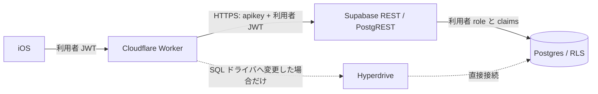

# 現行 Supabase REST 構成に対する Hyperdrive の適合性

2026-09-25 の判断。**今回の暇登録 API には Hyperdrive を導入しない。** STG の実計測で Worker→Supabase REST が主要な遅延要因と確認され、SQL 直結に移す価値が認証・RLS の再実装と運用負荷を上回る場合に限定して試す。これは Hyperdrive 自体の否定ではなく、現在の接続方式との適合判断である。

## 現行経路と Hyperdrive の対象

`SupabaseRestClient.ts` は Worker の `fetch` で Supabase `/rest/v1` を呼び、publishable key と利用者の Bearer JWT を送る。PostgREST 側が JWT の role/claims を DB に渡し、`availability_slots` の `auth.uid()`・`is_account_active()` を使う RLS が本人範囲を制限する。暇枠の通常登録は Worker→REST の POST １回、iOS は保存後に一覧 GET を行う。Worker の JWKS 取得と iOS→Worker の通信も別区間である。

Cloudflare の [Supabase 接続例](https://developers.cloudflare.com/hyperdrive/examples/connect-to-postgres/postgres-database-providers/supabase/)は、Hyperdrive を Supabase の**直接 Postgres 接続**と `pg` / Postgres.js の間に置く。Supabase REST や `supabase-js` の HTTPS 要求を Hyperdrive に経由させる構成ではない。従って、現在の `fetch` を保ったまま binding を追加しても、この経路の接続プールや SQL キャッシュは利用できない。

| 観点 | 現行 REST | Hyperdrive + SQL 直結へ移した場合 |
| --- | --- | --- |
| Worker→DB の方式 | HTTPS `fetch` → PostgREST → Postgres | SQL ドライバ → Hyperdrive → Postgres direct endpoint |
| 接続確立 | HTTP と PostgREST 側の接続管理 | Hyperdrive のエッジ側接続設定と origin 側プールを利用できる |
| 利用者認可 | Bearer JWT を PostgREST に渡し、role/claims と RLS を適用 | Worker が JWT を検証した後、**同一の短い transaction 内**で role と claims を設定し、RLS を検証する実装・テストが必要 |
| 機密 | Worker は DB password を持たず publishable key と本人 JWT を使う | Hyperdrive configuration が専用 DB role の接続資格情報を持つ |
| キャッシュ | 本人 API は `private, no-store` | Hyperdrive は read cache が既定で有効。本人データ、認可、削除状態、書込直後の読取には cache-disabled configuration が必要 |
| 運用 | 既存の API、migration、監視を継続 | driver、`nodejs_compat`、binding、DB role、接続上限、障害時の切戻しを追加 |
| 現時点の速度根拠 | TestFlight/hosted STG の区間別実測は未取得 | 同じ契約の A/B 実測なし。短縮幅は未確定 |

Hyperdrive は接続確立・プール・SQL 読取キャッシュを最適化する。[Cloudflare の仕組み](https://developers.cloudflare.com/hyperdrive/concepts/how-hyperdrive-works/)は SQL ドライバから origin DB までを対象にしている。現行の PostgREST HTTPS が遅いとしても、SQL 直結が必ず速いとは推論できない。特に暇登録は書込が中心で、読み込みも利用者ごとに分かれ、書込直後の鮮度が必要である。

## 認可と鮮度の条件

`availability_slots` の RLS は `auth.uid()` とアカウント有効状態を確認する。直接 SQL を使う場合、DB 接続を広い権限のまま使って `owner_user_id` だけで絞る実装へ置き換えない。Supabase の [RLS scoped Postgres client](https://supabase.com/docs/reference/server/middleware-withpostgresclient)が示すように、検証済み JWT の claims と `authenticated` role を**transaction-local**に設定して問い合わせ、終了時に接続を返す必要がある。プールされた接続間で identity が漏れないこと、別利用者・削除受付後の拒否、同時再送・競合を統合テストで証明する。

[Hyperdrive query caching](https://developers.cloudflare.com/hyperdrive/concepts/query-caching/)は既定で読取をキャッシュし、書込時に該当読取を無効化しない。もし試験するなら本人枠と認可関連は cache-disabled binding に限定する。Cloudflare は Supabase 接続に pooled string ではなく direct connection string を指定しており、接続数は Supabase Project の上限と他サービス分を合算して設定する。Cloudflare の [接続上限](https://developers.cloudflare.com/hyperdrive/platform/limits/)も環境・プランで確認する。

## 再検討するための測定

1. 現行 STG で同じ端末・同じ操作を初回/継続に分け、iOS signpost、Worker Traces の handler/JWT/fetch span、Supabase DB の実行時間を request ID で対応付ける。p50/p95/p99、失敗率、JWKS fetch 数、iOS の保存後 GET、端末と Worker の地域を記録する。個人の日時と token は記録しない。
2. 遅延の主因が iOS→Worker、セッション更新、Worker 初回/JWKS、PostgREST 処理、DB query、保存後 GET のどこかを分離する。Worker→REST が主要因でないなら Hyperdrive 試験に進まない。
3. 候補が残る場合、STG だけで別 endpoint/flag の SQL 直結 PoC を作る。専用最小権限 DB role、cache-disabled Hyperdrive、transaction-local claims/role、RLS/削除/競合の縦断テストを先に用意する。
4. 同じ workload で REST と PoC の end-to-end p95、DB 接続数、CPU、エラー率、月次コストを比較する。少なくとも現行の認可・鮮度・可用性を保ち、効果が安定して確認できた場合だけ切替を検討する。効果が不明なら REST を維持する。

## 判断の更新履歴

- 2026-09-25: 現行 Worker の Supabase REST と本人 JWT/RLS を確認。Hyperdrive は直接 SQL 接続向けであり、binding 追加だけでは現経路を改善しないため導入を保留。hosted STG の区間別実測と SQL 直結の安全性証拠を再検討条件にした。
