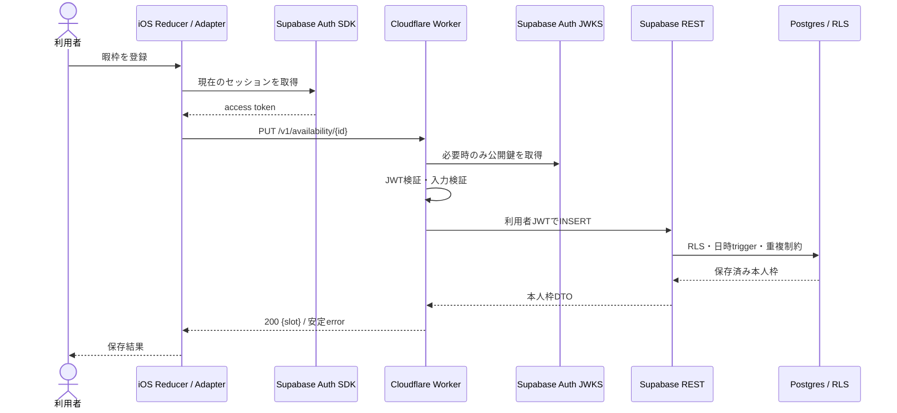

# 暇登録の通信経路と遅延観測

2026-09-25 の実装調査。TestFlight 既配布版の「最新の状態を取得できませんでした。」は通信遅延による timeout ではない。Release の `AppCompositionRoot` が `HimatchClient.productionPlaceholder` を選び、`addAvailability` が即座に `PrototypeError.notFound` を投げていた。従来の暇登録は Worker/Supabase へ到達していないため、既配布版に対する経路別の実測値は存在しない。

## 実接続後の経路

Worker 内の通常の新規登録は Supabase REST への書き込み１回で完了する。同じ UUID を再送して DB が競合を返した場合だけ、本人 JWT で既存枠を追加照会して「同内容の再送」と「異内容の競合」を分ける。現行 iOS adapter は登録・削除応答後に本人枠の GET を行うため、端末から見た保存完了は直列２リクエストである。GET は現在から14日以内に関係する本人枠だけを返す。自分の暇の API 応答は `private, no-store`。Mutation の自動再試行はしない。

## 計測点と読み方

起動時は削除受付状態・セッション・プロフィール取得がメイン画面への遷移条件になる。メイン画面表示後の友達情報と本人の暇時間は並行取得し、領域別の読み込み表示を使う。初回起動の待ち時間そのものはまだ実測しておらず、今回の部分読み込み変更でその遷移条件の所要時間が短くなるとは主張しない。

| 区間 | 観測手段 | 解釈と限界 |
| --- | --- | --- |
| iOS の各 HTTP 開始→応答 | iOS `OSSignposter` の `AvailabilityHTTP` interval | GET/PUT/DELETE の通信時間。セッション確認と Reducer 更新は含まない。TestFlight 端末で Instruments を採取する |
| iOS URLSession | `URLSessionTaskMetrics` の DNS/TCP/TLS/request/response 時刻 | 現行 adapter は `URLSession.shared` を使用。細分測定は専用 delegate を追加してから採取する。現在は未実装 |
| Cloudflare 入口→応答 | Workers Traces の handler span と request ID | Edge 内の経過時間。Cloudflare の colo と invocation を確認する |
| JWT 検証 | `auth.jwt.verify` custom span | JWKS の初回 fetch がある場合は子の fetch span と区別する |
| Worker→Supabase REST | Workers Traces の自動 fetch span | ネットワークと Supabase REST/DB 応答待ちを合算する。Postgres 実行だけの時間ではない |
| Supabase REST→Postgres | Supabase 側のクエリ/DB 観測 | hosted Project のログ・Query Performance への権限が必要。今回未測定 |

Workers の `performance.now()` は本番 runtime で I/O のない CPU 処理中に時計が進まないため、短い同期処理の単純な前後差を CPU 時間と解釈しない。Traces の handler/fetch/custom span を優先する。Cloudflare は fetch を自動計測し、colo と invocation ID を span 属性に含める。端末と Worker の時計は同時刻と仮定せず、同一リクエスト ID で追跡する。

## 遅延要因の確認結果

| 項目 | 現在の証拠 | 次の測定・判断 |
| --- | --- | --- |
| 不要な直列処理 | Worker の新規登録は単一 DB 往復。iOS は PUT/DELETE の後に一覧 GET を直列実行 | iOS interval と Worker trace を request ID で対照し、後続 GET の遅延を測る。保存済み DTO とローカル一覧を安全に合成できる契約へ変更するまでは GET を省かない |
| 重複認証 | iOS は保存前に SDK の現在 session を確認、Worker は署名と claims を検証、DB は利用者JWT/RLS を適用 | Auth SDK が期限切れで refresh する時と通常時を分けて測る。認可境界は削らない |
| コールドスタート/JWKS | `createApp` は依存を初回要求時に構築し、JWKS は必要時 fetch | 初回・継続、JWKS fetch有無を Traces で比較 |
| 接続再利用 | iOS は `URLSession.shared`、Worker は標準 `fetch` を使用 | DNS/TCP/TLS の再使用率を `URLSessionTaskMetrics` と Workers fetch span で確認 |
| リージョン | Worker の colo は trace 属性で観測可能、Supabase Project の実リージョンはこの調査では未確認 | colo と Project リージョンを同時に記録し、遠距離往復なら配置を検討 |
| timeout/retry | iOS は `URLSession.shared` の既定値、WorkerのSupabase呼出しは単発 `fetch` | p95/p99 と失敗率を実測後に制限時間を設定。書込の自動再送はUUID再送契約の検証後に検討 |
| キャッシュ | 暇APIは `private, no-store`。JWT JWKS は verifier の公開鍵取得経路 | 本人枠を共有キャッシュへ入れない。JWKSのヒット率をtraceで確認 |

## TestFlight での再現・採取

1. 修正後の staging Worker/DB migration と新しい TestFlight build の版を確認する。古い build では登録通信が発生しない。
2. 同一端末で初回起動後と継続利用中に、15分境界の未来枠を１つずつ登録する。ネットワーク条件、端末タイムゾーン、開始までの残時間を記録する。個人の日時そのものを共有ログへ載せない。
3. Instruments の iOS interval と Cloudflare Traces で成功/失敗、区間時間、colo、JWT/JWKS fetch、Supabase fetch 数を比較する。必要な場合だけ Supabase 側のクエリ計測を行う。
4. 再起動後の GET、同一 UUID/同内容の再送、異内容の競合、通信切断、別利用者のアクセス拒否、削除受付後の拒否を確認する。

この調査では実 TestFlight、Cloudflare、hosted Supabase の計測を行っていない。ミリ秒値、p95/p99、リージョン差や cold start の寄与は未確定である。

Hyperdrive と現行の REST 接続方式の比較、採用を再検討するための測定条件は[適合性の判断](../architecture/hyperdrive-evaluation.md)に記した。

## 一次資料

- [Cloudflare Workers custom spans](https://developers.cloudflare.com/workers/observability/traces/custom-spans/)、[自動 span と属性](https://developers.cloudflare.com/workers/observability/traces/spans-and-attributes/)、[Workers timers の制限](https://developers.cloudflare.com/workers/runtime-apis/performance/)（2026-09-25確認）
- [Apple OSSignposter](https://developer.apple.com/documentation/os/ossignposter)、[URLSessionTaskMetrics](https://developer.apple.com/documentation/foundation/urlsessiontaskmetrics)（2026-09-25確認）
